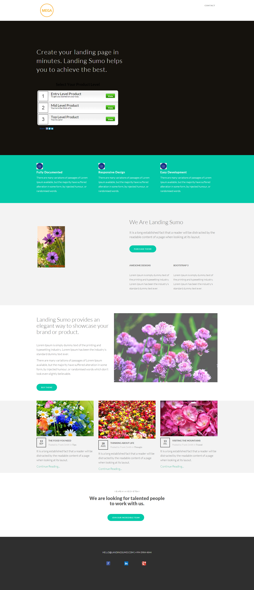

# Sjabloon 18C {#template-18c}

Klik met de rechtermuisknop om [downloadsjabloon 18C](https://experienceleague.adobe.com/landing/marketo/lp-templates/template-18c.html?lang=nl-NL)

Deze sjabloon bevat de volgende inhoud:

* Een koptekst (optioneel)
* Een primaire sectie

   * inclusief hoofdtekst en opiniepeiling

* Vijf carrosseriesegmenten (optioneel)
* Voettekst (optioneel)

**Klik hieronder met de rechtermuisknop om deze sjabloon te downloaden:**

[Sjabloon 18C.html](https://experienceleague.adobe.com/landing/marketo/lp-templates/template-18c.html?lang=nl-NL)
