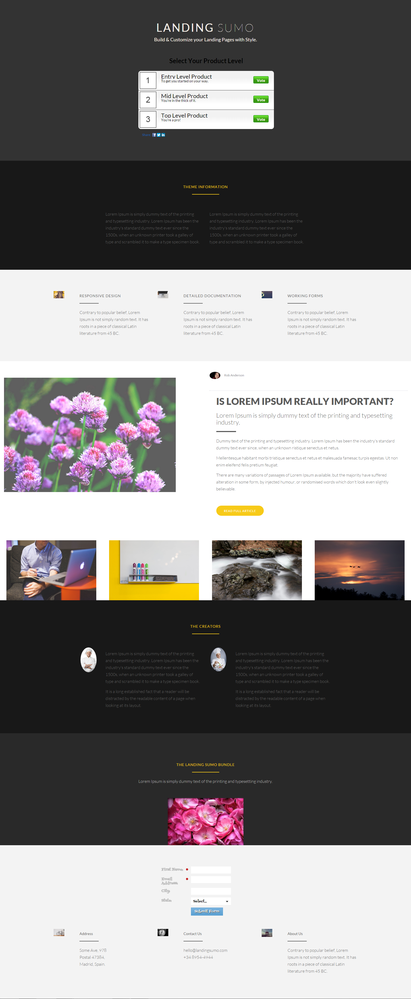

# Sjabloon 19C {#template-19c}

[Sjabloon 19C downloaden](https://experienceleague.adobe.com/landing/marketo/lp-templates/template-19c.html)

Deze sjabloon bevat de volgende inhoud:

* Een primaire sectie

   * omvat hoofdtitel, hoofdtekst, hoofdopiniepeiling

* Vijf carrosseriesegmenten (optioneel)
* Voettekst (optioneel)

**Klik hieronder om deze sjabloon te downloaden:**

[Sjabloon 19C.html](https://experienceleague.adobe.com/landing/marketo/lp-templates/template-19c.html)
