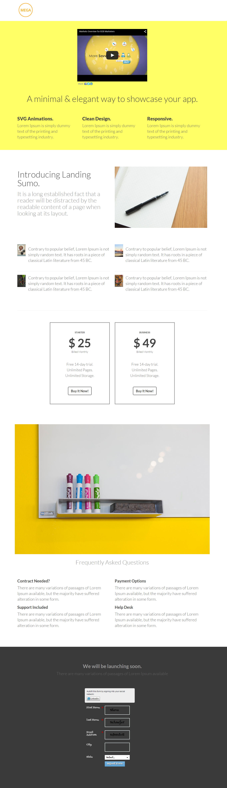

# Template 5B {#template-5b}

Klik met de rechtermuisknop om [downloadsjabloon 5B](https://experienceleague.adobe.com/landing/marketo/lp-templates/template-5b.html?lang=nl-NL)

Deze sjabloon bevat de volgende inhoud:

* Een koptekst (optioneel)
* Een primaire sectie

   * omvat de hoofdtitel en hoofdtekst.

* Vijf carrosseriesegmenten (optioneel)
* Voettekst (optioneel)

**Klik hieronder met de rechtermuisknop om deze sjabloon te downloaden:**

[Sjabloon 5B.html](https://experienceleague.adobe.com/landing/marketo/lp-templates/template-5b.html?lang=nl-NL)
