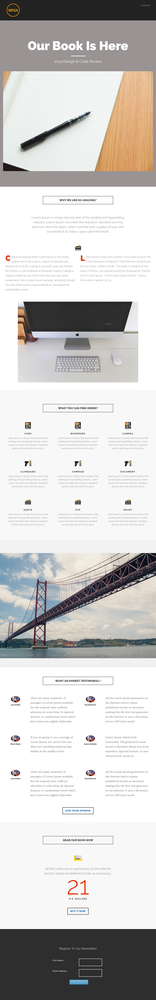

# Sjabloon 8B {#template-8b}

Klik met de rechtermuisknop aan [ downloadmalplaatje 8B ](https://experienceleague.adobe.com/landing/marketo/lp-templates/template-8b.html?lang=nl-NL)

Deze sjabloon bevat de volgende inhoud:

* Een koptekst (optioneel)
* Een primaire sectie

   * omvat een hoofdkoptekst, een hoofdafbeelding en hoofdtekst

* Vijf carrosseriesegmenten (optioneel)
* Een voettekst (optioneel)

**klik hieronder met de rechtermuisknop aan om dit malplaatje te downloaden:**

[ Malplaatje 8B.html ](https://experienceleague.adobe.com/landing/marketo/lp-templates/template-8b.html?lang=nl-NL)
