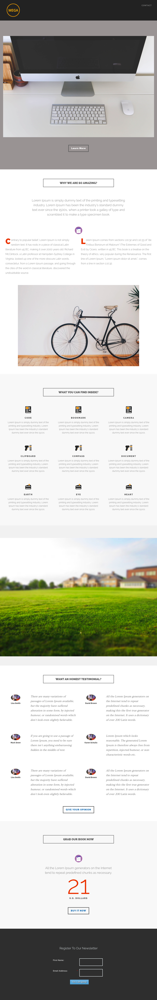

# Sjabloon 8G {#template-8g}

Klik met de rechtermuisknop om [ Sjabloon 8G te downloaden ](https://experienceleague.adobe.com/landing/marketo/lp-templates/template-8g.html)

Deze sjabloon bevat de volgende inhoud:

* Een koptekst (optioneel)
* Een primaire sectie

   * bevat een hoofdafbeelding en een knop

* Vijf carrosseriesegmenten (optioneel)
* Een voettekst (optioneel)

**klik hieronder met de rechtermuisknop aan om dit malplaatje te downloaden:**

[ Malplaatje 8G.html ](https://experienceleague.adobe.com/landing/marketo/lp-templates/template-8g.html)
