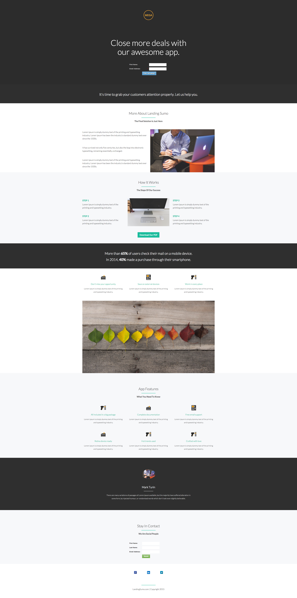

# Template 9A {#template-9a}

Klik met de rechtermuisknop aan [&#x200B; downloadmalplaatje 9A &#x200B;](https://experienceleague.adobe.com/landing/marketo/lp-templates/template-9a.html?lang=nl-NL)

Deze sjabloon bevat de volgende inhoud:

* Een primaire sectie

   * bevat een hoofdafbeelding van het logo, een hoofdkoptekst en een formulier

* Acht carrosseriesegmenten (optioneel)
* Een voettekst (optioneel)

**klik hieronder met de rechtermuisknop aan om dit malplaatje te downloaden:**

[&#x200B; Malplaatje 9A.html &#x200B;](https://experienceleague.adobe.com/landing/marketo/lp-templates/template-9a.html?lang=nl-NL)
