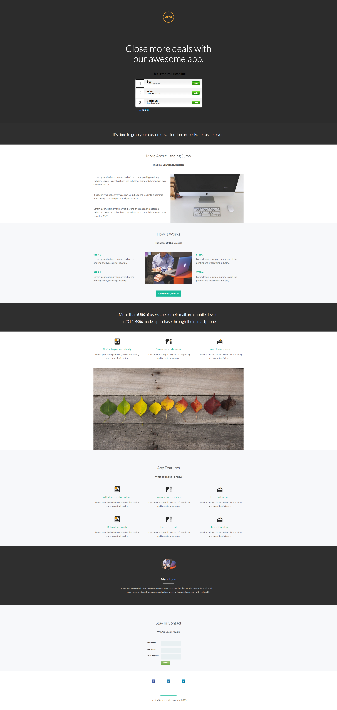

# Sjabloon 9D {#template-9d}

Klik met de rechtermuisknop om [&#x200B; Sjabloon 9D te downloaden &#x200B;](https://experienceleague.adobe.com/landing/marketo/lp-templates/template-9d.html?lang=nl-NL)

Deze sjabloon bevat de volgende inhoud:

* Een primaire sectie

   * bevat een logo-afbeelding, een hoofdtekst en een opiniepeiling

* Acht carrosseriesegmenten (optioneel)
* Een voettekst (optioneel)

**klik hieronder met de rechtermuisknop aan om dit malplaatje te downloaden:**

[&#x200B; Malplaatje 9D.html &#x200B;](https://experienceleague.adobe.com/landing/marketo/lp-templates/template-9d.html?lang=nl-NL)
