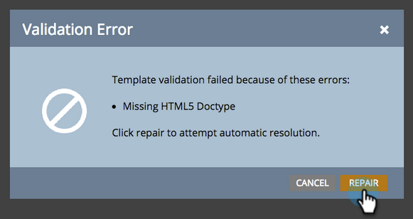

# Een bestaande landingspaginasjabloon in vrije vorm maken [!UICONTROL Mobile Compatible] {#make-an-existing-free-form-landing-page-template-mobile-compatible}

Dit kan op twee plaatsen worden gedaan, de Redacteur van het Malplaatje en de het Landen Redacteur van de Pagina.

## Upgrade uitvoeren vanuit de Sjablooneditor {#upgrade-from-the-template-editor}

1. Ga naar de **[!UICONTROL Design Studio]** .

   

1. Selecteer **[!UICONTROL Templates]**.

   

1. Selecteer een sjabloon waarbij **[!UICONTROL Mobile Compatible]** **[!UICONTROL No]** is.

   

1. Klik op **[!UICONTROL Edit Draft]**.

   

1. Klik op **[!UICONTROL Make Mobile Compatible]**.

   

1. Klik op **[!UICONTROL Upgrade]**.

   

   Uw sjabloon voor de openingspagina is nu compatibel met mobiele apparaten.

   >[!NOTE]
   >
   >De upgrade moet onschadelijk zijn, maar zorg dat de pagina&#39;s op eventuele verschillen worden gecontroleerd. Als u een upgrade uitvoert, worden concepten gemaakt van alle bestemmingspagina&#39;s die gebruikmaken van die sjabloon.

   

## Wat maakt een sjabloon [!UICONTROL Mobile Compatible]? {#what-makes-a-template-mobile-compatible}

Geweldige vragen! Uw sjabloon moet de volgende tags hebben:

`Must have <!DOCTYPE HTML> Must have a <HEAD> element Must have a <TITLE> in the <HEAD> element Must have <META CHARSET="UTF-8"> within the <HEAD> element Must have a <BODY> element that contains one (and only one) 

`

Als alles er goed uitziet, ziet u dit bericht.

Als er iets misgaat, wordt er een foutbericht weergegeven. Klik op Herstellen om het probleem op te lossen en herhaal het validatieproces.

Als u wijzigingen aanbrengt in de sjabloon, klikt u op [!UICONTROL Template Actions] en selecteert u [!UICONTROL Validate Mobile Compatibility] .

## Een sjabloon bijwerken vanuit de editor voor vrije bestemmingspagina {#upgrading-a-template-from-the-free-form-landing-page-editor}

Wanneer u een bestemmingspagina uitgeeft en u op het mobiele lusje klikt, zult u soms merken het malplaatje niet is bevorderd. Vrees niet! U kunt het daar upgraden.

1. Klik op de tab **[!UICONTROL Mobile]** .

   

1. Klik op het selectievakje en klik op **[!UICONTROL Activate]** .

   

   >[!NOTE]
   >
   >Als u de mobiele versie van een sjabloon activeert, worden concepten gemaakt van alle bestemmingspagina&#39;s die deze gebruiken.

Geweldig! U kunt nu [&#x200B; de mobiele mening &#x200B;](/help/marketo/product-docs/demand-generation/landing-pages/free-form-landing-pages/customize-mobile-view-for-your-free-form-landing-page.md) van al uw het landen pagina&#39;s aanpassen die dit malplaatje gebruiken.
