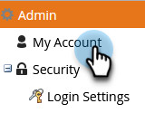

# Aanvullende landingspaginanamen toevoegen {#add-additional-landing-page-cnames}

U kunt landingspagina&#39;s toevoegen om verschillende URL&#39;s toe te staan om naar de Marketo-bestemmingspagina&#39;s te wijzen. Als u de onderstaande stappen uitvoert, kunt u meerdere domeinen beheren.

>[!CAUTION]
>
>Cookies kunnen niet worden gedeeld in verschillende domeinen.

>[!TIP]
>
>**Zelfde hoogste niveaudomein - Goed! Cookies worden gedeeld**.  **ga** .mycompany.com > **info** .mycompany.com
>
>**Verschillende hoogste niveaudomeinen - Slecht! De cookies zijn _niet_ gedeeld**.  go.**mijnbedrijf**.com > gaat.**mijnbedrijf**.com

>[!NOTE]
>
>**Vereiste Bevoegdheden Admin**

1. Ga naar het **Admin** gebied.

   

1. Klik **Mijn Rekening**.

   

1. Blader omlaag naar &quot;Ondersteuningsinformatie&quot; en kopieer uw Munchkin-id.

   

## Verzoek verzenden naar IT {#send-request-to-it}

1. Vraag uw afdeling van IT om volgende CNAME te opstelling: (Vervang het woord [ CNAME ] met de NAAM van uw keus en [ identiteitskaart van Munchkin ] met de tekst van de vorige stap).

   [ .YourCompany.com ] identiteitskaart van Munchkin [ .mktoweb.com]

## Een nieuwe NAAM toevoegen {#add-a-new-cname}

1. Zodra uw afdeling van IT CNAME heeft gecreeerd, ga naar het **Admin** gebied.

   

1. Klik **het Bestaan Pagina&#39;s**.

   

1. Klik op **[!UICONTROL New]** en selecteer vervolgens **[!UICONTROL New Domain Alias]** .

   

1. Voer uw **[!UICONTROL Domain Alias]in.** De **[!UICONTROL Default Page]** wordt weergegeven als de bezoeker geen URL plaatst. Voer in dat geval in waar ze naartoe moeten.

   >[!NOTE]
   >
   >Voor [!UICONTROL Default Page] kunt u een bestemmingspagina of een externe URL selecteren, zoals uw openbare website.

   

1. Voer uw **[!UICONTROL Default Page]** in en klik op **[!UICONTROL Create]** .

   

Mooi! Nu weet u wat te doen als u ooit een NAAM wilt toevoegen.
