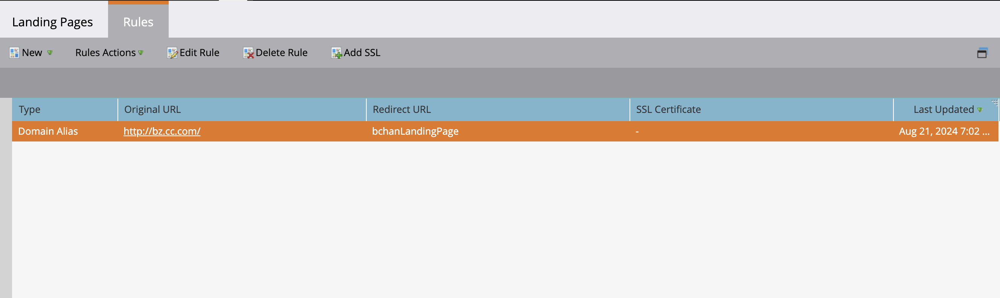

# SSL toevoegen aan uw bestemmingspagina&#39;s {#add-ssl-to-your-landing-pages}

Met SSL-codering (Secure Socket Layer) kunt u al uw bestemmingspagina&#39;s voor een Marketo Engage-instantie beveiligen.

Wanneer u een webformulier invult of een bestemmingspagina bezoekt die door Marketo Engage wordt gehost, wordt de informatie standaard verzonden via een niet-beveiligd protocol (HTTP). Volgens het beleid van uw bedrijf wilt u mogelijk de gegevens beveiligen die via HTTPS aan Marketo worden verzonden. Wanneer u bijvoorbeeld `http://info.mydomain.com/` bezoekt, wordt dit nu `https://info.mydomain.com/` .

Marketo Engage houdt standaard &quot;Bezochte webpagina&quot; en &quot;Klik op Koppeling op webpagina&quot; bij via een niet-beveiligd HTTP-protocol. Als u de trackingkoppelingen wilt beveiligen met een eigen certificaat, moet u Marketo een aparte, niet-gedeelde server laten bouwen om deze in te schakelen. Om alle aspecten van de interactie van een contact met u te beveiligen betekent typisch het beveiligen van zowel het Landen Pagina&#39;s als het volgen van verbindingen.

>[!IMPORTANT]
>
>Voordat u SSL toevoegt, moet u controleren of uw contract het totale aantal domeinen bevat dat u mag toevoegen. Anders brengt u mogelijk kosten in rekening. Als u de informatie niet kunt vinden, kunt u contact opnemen met het Adobe-accountteam (uw accountmanager) voor meer informatie.

## SSL-certificering inschakelen {#enable-ssl-certification}

Voeg automatisch SSL toe voor alle domeinaliassen die u maakt als onderdeel van de regels voor de landingspagina.

1. Ga naar het **Admin** gebied.

   

1. Selecteer **het Bestaan Pagina&#39;s** van de boom. In het **lusje van Regels**, klik **Nieuwe** drop-down en selecteer **Nieuwe Alias van het Domein**.

   

1. Ga uw _Alias van het Domein_ en _StandaardPagina_ in. Selecteer **produceren SSL Certificaat** checkbox. Klik **creëren** wanneer gedaan.

   

Hiermee wordt automatisch een SSL-certificaat voor dit domein toegevoegd.

## SSL inschakelen voor uw standaarddomein {#enable-ssl-default-domain}

Voer de onderstaande stappen uit om SSL in te schakelen voor uw standaarddomein.

1. Nog in de **Admin** sectie, uitgezochte **Landing Pagina&#39;s**. Klik de oranje **uitgeven** knoop naast _Montages_.

   {width="800" zoomable="yes"}

   >[!NOTE]
   >
   >U kunt desgewenst ook de domeinnaam hier wijzigen (een geldig domein is vereist).

1. Schakel het selectievakje SSL-certificaat genereren in en klik op Opslaan.

   

>[!NOTE]
>
>Het kan tot drie minuten duren voor SSL in de READY staat is. Vernieuw de pagina zodat de wijzigingen worden weergegeven.

## SSL&#39;s bewerken voor bestaande domeinaliassen

Voer de volgende stappen uit om SSL in te schakelen voor uw bestaande domeinaliassen.

1. Vouw in het gebied _[!UICONTROL Admin]_&#x200B;**[!UICONTROL Integration]**&#x200B;in de linkernavigatie uit en selecteer **[!UICONTROL Landing Pages]**.

1. Selecteer op de pagina de tab **[!UICONTROL Rules]** bovenaan.

1. Selecteer de domeinaliasrij die u wilt bewerken en klik op **[!UICONTROL Add SSL]** bovenaan.

   {width="800" zoomable="yes"}

1. Klik in het dialoogvenster op **[!UICONTROL Confirm]** .

   {width="400"}

>[!NOTE]
>
>Het kan tot drie minuten duren voor SSL in de READY staat is. Vernieuw de pagina zodat de wijzigingen worden weergegeven.

## Foutberichten {#error-messages}

Hieronder vindt u foutberichten die u samen met de definities kunt ontvangen.

<table><thead>
  <tr>
    <th>Fout</th>
    <th>Details</th>
  </tr></thead>
<tbody>
<tr>
    <td><i>Domein bestaat al.</i></td>
    <td>Er bestaat al een domein met dezelfde naam.</td>
  </tr>
  <tr>
    <td><i>Domein wordt niet toegewezen aan het standaarddomein.</i></td>
    <td>Het aangepaste domein wordt niet correct toegewezen aan het standaarddomein. Verifieer de instellingen voor domeintoewijzing en zorg ervoor dat de DNS-configuratie naar het juiste standaarddomein wijst.</td>
  </tr>
  <tr>
    <td><i>SSL-certificaten kunnen niet worden uitgegeven vanwege niet-ondersteunde CAA-records. Vraag uw IT om uw CAA-records bij te werken.</i></td>
    <td>De CAA-records zijn niet bijgewerkt. Voor wie gebruikmaakt van door Marketo Engage beheerde SSL-certificaten, moeten CAA-records worden bijgewerkt naar certificaten die door onze leverancier worden aanbevolen. Neem contact op met uw IT-afdeling om de CAA-records bij te werken. Zie <a href="https://nation.marketo.com/t5/product-blogs/changes-to-marketo-engage-secured-domains-platform/ba-p/329305#M2246"> deze pagina </a> voor extra details.</td>
  </tr>
  <tr>
    <td><i>SSL-certificaat is al uitgegeven.</i></td>
    <td>Er bestaat al een SSL-certificaat voor dit aangepaste domein. Er is geen verdere actie nodig tenzij het certificaat is verlopen of opnieuw moet worden uitgegeven.</td>
  </tr>
  <tr>
    <td><i>Het standaarddomein is niet gevonden. Neem contact op met de Technische Ondersteuning voor hulp.</i></td>
    <td>Er is een probleem opgetreden bij het zoeken naar het standaarddomein. Neem contact op met de ondersteuningsafdeling zodat ze dit kunnen onderzoeken.</td>
  </tr>
  <tr>
    <td><i>Onverwachte fout aangetroffen tijdens het maken van een domein. Neem contact op met de Technische Ondersteuning voor hulp.</i></td>
    <td>Er is een onverwachte fout opgetreden. Gelieve te verzamelen logboeken en foutendetails, en escaleer de kwestie aan <a href="https://nation.marketo.com/t5/support/ct-p/Support" target="_blank"> de Steun van Marketo </a>.</td>
  </tr>
</tbody></table>

## Notities {#things-to-note}

* **DNS afbeelding voor domein aan Marketo Engage**: Alvorens domeinen in UI toe te voegen, moet u [ CNAMEs aan een Marketo-Geleverd domein ](https://experienceleague.adobe.com/nl/docs/marketo/using/getting-started/initial-setup/setup-steps#customize-your-landing-page-urls-with-a-cname){target="_blank"} in kaart brengen.

* **Aangepaste SSLs**: Als u douane SSL nodig hebt, gelieve a [ kaartje van de Steun ](https://nation.marketo.com/t5/support/ct-p/Support){target="_blank"} voor te leggen. Gebruik het selectievakje voor zelfbediening niet voor het maken van SSL.

* **Vooraf bestaande SSLs**: Terwijl het toevoegen van een domein, controleert het systeem reeds bestaande SSLs, die manueel kan zijn gecreeerd vroeger. Als u deze validatie tegenkomt, maakt u uw domein zonder SSL-ontwerp te selecteren en maken we er verbinding mee. [ de Steun van het Contact ](https://nation.marketo.com/t5/support/ct-p/Support){target="_blank"} meer extra details/opties.

* **Schrapping van domeinen**: Automatisch schrappend een domein **schrapt niet** het SSL certificaat. Deze handleiding voorkomt gebruikersfouten die ertoe leiden dat een website geen SSL-certificaten heeft. Als u de SSL certificaten wilt verwijderen, [ contactSteun ](https://nation.marketo.com/t5/support/ct-p/Support){target="_blank"}.
