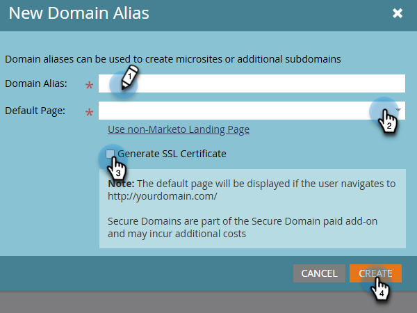

# SSL toevoegen aan uw bestemmingspagina&#39;s {#add-ssl-to-your-landing-pages}

Met SSL-codering (Secure Socket Layer) kunt u al uw bestemmingspagina&#39;s voor een Marketo Engage-instantie beveiligen.

Wanneer u een webformulier invult of een bestemmingspagina bezoekt die door Marketo Engage wordt gehost, wordt de informatie standaard verzonden via een niet-beveiligd protocol (HTTP). Volgens het beleid van uw bedrijf wilt u mogelijk de gegevens beveiligen die via HTTPS aan Marketo worden verzonden. Wanneer u bijvoorbeeld `http://info.mydomain.com/` bezoekt, wordt dit nu `https://info.mydomain.com/` .

Marketo Engage houdt standaard &quot;Bezochte webpagina&quot; en &quot;Klik op Koppeling op webpagina&quot; bij via een niet-beveiligd HTTP-protocol. Als u de trackingkoppelingen wilt beveiligen met een eigen certificaat, moet u Marketo een aparte, niet-gedeelde server laten bouwen om deze in te schakelen. Om alle aspecten van de interactie van een contact met u te beveiligen betekent typisch het beveiligen van zowel het Landen Pagina&#39;s als het volgen van verbindingen.

## SSL-certificering inschakelen {#enable-ssl-certification}

Voeg automatisch SSL toe voor alle domeinaliassen die u maakt als onderdeel van de regels voor de landingspagina.

1. Ga naar het **Admin** gebied.

   

1. Selecteer **het Bestaan Pagina&#39;s** van de boom. In het **lusje van Regels**, klik **Nieuwe** drop-down en selecteer **Nieuwe Alias van het Domein**.

   

1. Ga uw _Alias van het Domein_ en _StandaardPagina_ in. Selecteer **produceren SSL Certificaat** checkbox. Klik **creëren** wanneer gedaan.

   

Hiermee wordt automatisch een SSL-certificaat voor dit domein toegevoegd.

## SSL inschakelen voor uw standaarddomein {#enable-ssl-default-domain}

Voer de onderstaande stappen uit om SSL in te schakelen voor uw standaarddomein.

1. Nog in de **Admin** sectie, uitgezochte **Landing Pagina&#39;s**. Klik de oranje **uitgeven** knoop naast _Montages_.

   {width="800" zoomable="yes"}

   >[!NOTE]
   >
   >U kunt desgewenst ook de domeinnaam hier wijzigen (een geldig domein is vereist).

1. Schakel het selectievakje SSL-certificaat genereren in en klik op Opslaan.

   

>[!NOTE]
>
>* In de kolom SSL-certificaat in de lijst wordt de certificaatstatus weergegeven voor alle domeinalias die is gemaakt nadat deze functie is uitgebracht (25 april 2025). Als de SSL voor een domein via Marketo Support is ingeschakeld, blijft het certificaat bestaan, maar wordt het niet weergegeven in de tabel. In deze tabel worden alleen SSL-certificaten weergegeven voor domeinen die zijn toegevoegd met de stappen in dit artikel.
>
>* Het kan maximaal drie minuten duren voordat de status van SSL READY is ingeschakeld. De wijzigingen worden alleen weergegeven als u de pagina vernieuwt.

## Foutberichten {#error-messages}

Hieronder vindt u foutberichten die u samen met de definities kunt ontvangen.

<table><thead>
  <tr>
    <th>Fout</th>
    <th>Details</th>
  </tr></thead>
<tbody>
  <tr>
    <td><i>Onverwachte fout aangetroffen tijdens het maken van een domein. Neem contact op met de Technische Ondersteuning voor hulp.</i></td>
    <td>Er is een onverwachte fout opgetreden. Verzamel logbestanden en foutgegevens en escaleer het probleem naar Support.</td>
  </tr>
  <tr>
    <td><i>Het standaarddomein is niet gevonden. Neem contact op met de Technische Ondersteuning voor hulp.</i></td>
    <td>Er is een probleem opgetreden bij het zoeken naar het standaarddomein. Neem contact op met de ondersteuningsafdeling zodat ze dit kunnen onderzoeken.</td>
  </tr>
  <tr>
    <td><i>SSL-certificaat is al uitgegeven.</i></td>
    <td>Er bestaat al een SSL-certificaat voor dit aangepaste domein. Er is geen verdere actie nodig tenzij het certificaat is verlopen of opnieuw moet worden uitgegeven.</td>
  </tr>
  <tr>
    <td><i>Domein wordt niet toegewezen aan het standaarddomein.</i></td>
    <td>Het aangepaste domein wordt niet correct toegewezen aan het standaarddomein. Verifieer de instellingen voor domeintoewijzing en zorg ervoor dat de DNS-configuratie naar het juiste standaarddomein wijst.</td>
  </tr>
  <tr>
    <td><i>Domein bestaat al.</i></td>
    <td>Er bestaat al een domein met dezelfde naam.</td>
  </tr>
  <tr>
    <td><i>Een eenmalige IP configuratie wordt vereist alvorens meer domeinen toe te voegen. Neem contact op met de Technische ondersteuning om de installatie en het proberen te voltooien en een ander domein toe te voegen.</i></td>
    <td>Voor het eerste aangepaste domein na het standaarddomein is een eenmalige instelling vereist die door u moet worden geïnitieerd. Gelieve te verhogen een kaartje van de Steun om de opstelling te voltooien en het domein toe te voegen nadat zij worden gedaan.</td>
  </tr>
</tbody></table>

## Notities {#things-to-note}

* **DNS afbeelding voor domein aan Marketo Engage**: Alvorens domeinen in UI toe te voegen, moet u [ CNAMEs aan een Marketo-Geleverd domein ](https://experienceleague.adobe.com/nl/docs/marketo/using/getting-started/initial-setup/setup-steps#customize-your-landing-page-urls-with-a-cname){target="_blank"} in kaart brengen.

* **Aangepaste SSLs**: Als u douane SSL nodig hebt, gelieve a [ kaartje van de Steun ](https://nation.marketo.com/t5/support/ct-p/Support){target="_blank"} voor te leggen. Gebruik het selectievakje voor zelfbediening niet voor het maken van SSL.

* **Vooraf bestaande SSLs**: Terwijl het toevoegen van een domein, controleert het systeem reeds bestaande SSLs, die manueel kan zijn gecreeerd vroeger. Als u deze validatie tegenkomt, maakt u uw domein zonder SSL-ontwerp te selecteren en maken we er verbinding mee. [ de Steun van het Contact ](https://nation.marketo.com/t5/support/ct-p/Support){target="_blank"} meer extra details/opties.

* **Eerste-tijd het volgen domein**: De eerste-tijd verwezenlijking van e-mail het volgen verbindingsdomeinen zal handinterventie door [ Steun van Marketo ](https://nation.marketo.com/t5/support/ct-p/Support){target="_blank"} vergen. Het volgende subdomein wordt gecreeerd onder het zelfde domein toegestaan in UI.

* **Marketo op Prem slechts**: Momenteel, is deze eigenschap slechts beschikbaar voor op-Prem. Marketo Engage op de Diensten van de Wolk zal aan opstelling SSL moeten door uit te gaan naar [ Steun van Marketo ](https://nation.marketo.com/t5/support/ct-p/Support){target="_blank"}.

* **Toevoegend certs aan bestaande domeinen**: Het toevoegen van certs aan bestaande domeinen wordt momenteel niet gesteund. Voor reeds bestaande domeinen, of voor gevallen waar u het SSL certificaatvakje gemist hebt, moet u uit aan [ de Steun van Marketo ](https://nation.marketo.com/t5/support/ct-p/Support){target="_blank"} reiken om het toegevoegde certificaat te krijgen.

* **Schrapping van domeinen**: Het schrappen van een domein schrapt automatisch niet het SSL certificaat op dit ogenblik. Deze kwestie zal in een toekomstige versie worden besproken.
