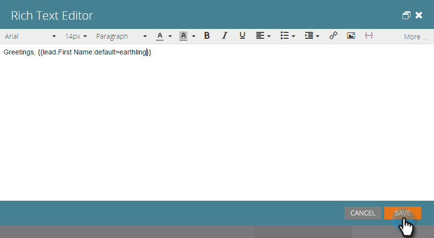

# Tekst en tokens toevoegen aan een bestemmingspagina {#add-text-and-tokens-to-a-landing-page}

>[!NOTE]
>
>Tokens worden alleen ondersteund op bestemmingspagina&#39;s van Marketo.

## Rijke tekst toevoegen aan uw bestemmingspagina {#add-rich-text-to-your-landing-page}

1. Selecteer de openingspagina en klik op Concept **** bewerken.

   

   >[!NOTE]
   >
   >De landende paginaontwerper opent in een nieuw venster.

1. Sleep over het element **Rich Text** .

   

1. Voer de gewenste tekst in en klik op **Opslaan**.

   

Nu u weet hoe te om tekst aan een het landen pagina toe te voegen, laten wij aan het toevoegen van een teken werken.

## Een token toevoegen aan uw bestemmingspagina {#add-a-token-to-your-landing-page}

Tokens zijn dynamische tekstfragmenten die uw openingspagina kunnen aanpassen.

>[!TIP]
>
>Dingen zoals Voornaam komen uit het persoonsdossier. Andere tokens komen van het Mijn lusje van Tokens in het programma.

1. Selecteer de openingspagina en klik op Concept **** bewerken.

   

   >[!NOTE]
   >
   >De landende paginaontwerper opent in een nieuw venster.

1. Dubbelklik op het tekstvak Rich waaraan u het token wilt toevoegen.

   

1. Klik op het pictogram Token invoegen.

   

1. Zoek en selecteer de token van uw keuze.

   

1. Voer een **standaardwaarde** in en klik op **Invoegen**.

   

1. Klik op **Opslaan**.

   

   Opdracht voltooid! U hebt nu een token op uw bestemmingspagina.

