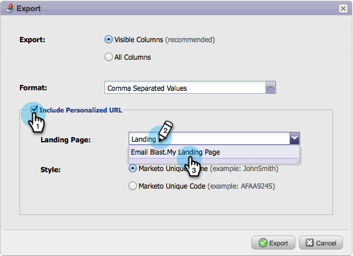

# Een lijst met gepersonaliseerde URL&#39;s exporteren {#export-a-list-with-personalized-urls}

>[!PREREQUISITES]
>
>* [Persoonlijke URL&#39;s voor uw account inschakelen](enable-personalized-urls-for-your-account.md)
>* [Persoonlijke URL&#39;s inschakelen voor een bestemmingspagina](enable-personalized-urls-for-a-landing-page.md)

>

1. Selecteer uw lijst of slimme lijst, klik op het tabblad **Regelafstand** om de resultaten op te halen en klik vervolgens op het pictogram Uitrol. INLINE Zorg ervoor u **Marketo Unieke Code **en **Marketo Unieke** kolommen van de Naam [zichtbaar](../../../../product-docs/core-marketo-concepts/smart-lists-and-static-lists/using-smart-lists/create-and-change-views-for-lists-and-smart-list.md)hebt.

   

1. Schakel **Inclusief gepersonaliseerde URL** in, zoek en selecteer de bestemmingspagina waarvoor u URL&#39;s wilt genereren.

   

1. Selecteer de **URL**.

   

   >[!TIP]
   >
   >Als er meerdere URL&#39;s voor dezelfde landingspagina worden weergegeven, is dit waarschijnlijk omdat u de URL van de pagina&#39;s op een bepaald punt in het verleden hebt gewijzigd en een omleiding hebt gemaakt.

1. Kies een **stijl** en klik op **Exporteren**.

   

1. Wanneer het exporteren is voltooid, klikt u op de koppeling **Nu** downloaden om het bestand op te slaan.

   

   En je bent klaar! U hebt nu een lijst met leads en gepersonaliseerde URL&#39;s.

   

   >[!NOTE]
   >
   >Als er leads zijn met dezelfde voornaam en achternaam, worden getallen automatisch toegevoegd om ervoor te zorgen dat de URL&#39;s uniek blijven.

