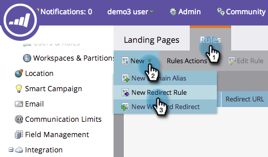

# Een URL-pad omleiden {#redirect-a-url-path}

Met Marketo kunt u een URL-pad gemakkelijk omleiden naar elke gewenste pagina. Zo gaat het.

>[!NOTE]
>
>**Vereiste Bevoegdheden Admin**

1. Klik onder **[!UICONTROL Admin]** op **[!UICONTROL Landing Pages]** .

   

1. Klik op de tab **[!UICONTROL Rules]** en klik vervolgens op **[!UICONTROL New]** en **[!UICONTROL New Redirect Rule]** .

   

1. Klik op de eerste vervolgkeuzelijst **[!UICONTROL Original URL]** en selecteer de Marketo CNAME.

   

   >[!NOTE]
   >
   >Herinner me, kunt u URLs slechts opnieuw richten die met uw Marketo [&#x200B; CNAME &#x200B;](/help/marketo/product-docs/demand-generation/landing-pages/landing-page-actions/customize-your-landing-page-urls-with-a-cname.md) beginnen.

1. Typ het URL-pad (of de specifieke pagina) dat u wilt omleiden in het tweede **[!UICONTROL Original URL]** -veld rechts.

   

1. Klik op **[!UICONTROL Use non-Marketo Landing Page]** , typ de pagina waarnaar u bezoekers wilt omleiden in het veld **[!UICONTROL Redirect URL]** en klik op **[!UICONTROL Create]** .

   

   U kunt [&#x200B; gebruiken Marketo landende pagina&#39;s &#x200B;](/help/marketo/product-docs/demand-generation/landing-pages/landing-page-actions/redirect-a-marketo-landing-page-to-another-page.md) als bestemming ook.

Gefeliciteerd! U hebt het URL-pad omgeleid.

>[!MORELIKETHIS]
>
>[&#x200B; richt een Marketo het Bestaan Pagina aan Een andere Pagina &#x200B;](/help/marketo/product-docs/demand-generation/landing-pages/landing-page-actions/redirect-a-marketo-landing-page-to-another-page.md) opnieuw
