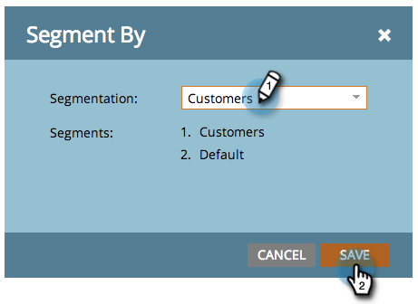

# Dynamische inhoud gebruiken in een bestemmingspagina {#use-dynamic-content-in-a-landing-page}

>[!PREREQUISITES]
>
>* [ creeer een Segmentatie ](/help/marketo/product-docs/personalization/segmentation-and-snippets/segmentation/create-a-segmentation.md)
>* [ creeer een Vrije-Vorm het Landen Pagina ](/help/marketo/product-docs/demand-generation/landing-pages/free-form-landing-pages/create-a-free-form-landing-page.md)
>* [ voeg een Nieuwe Vorm aan een Vrije-Vorm Landing Pagina toe ](/help/marketo/product-docs/demand-generation/landing-pages/free-form-landing-pages/add-a-new-form-to-a-free-form-landing-page.md)

Door dynamische inhoud te gebruiken op bestemmingspagina&#39;s, worden mensen met gerichte informatie ingeschakeld.

## Segmentering toevoegen {#add-segmentation}

1. Ga naar **[!UICONTROL Marketing Activities]** .

   

   Klik op uw **[!UICONTROL Landing Page]** en vervolgens op **[!UICONTROL Edit Draft]** .

   

   Klik op **[!UICONTROL Segment By]**.

   

   Voer de naam **[!UICONTROL Segmentation]** in en klik op **[!UICONTROL Save]** .

   

   De segmentatie en de bijbehorende segmenten worden rechts onder **[!UICONTROL Dynamic]** weergegeven.

   

   >[!NOTE]
   >
   >Alle openende pagina-elementen zijn standaard **[!UICONTROL Static]** .

## Element dynamisch maken {#make-element-dynamic}

1. Sleep elementen van **[!UICONTROL Static]** naar **[!UICONTROL Dynamic]** .

   

1. U kunt ook elementen maken [!UICONTROL Static] of [!UICONTROL Dynamic] vanuit het element **[!UICONTROL Settings]** .

   

## Dynamische inhoud toepassen {#apply-dynamic-content}

1. Selecteer een element onder een segment en klik op **[!UICONTROL Edit]** . Herhaal dit voor elk segment.

   

1. Een groen vinkje geeft de inhoud aan die specifiek is voor een segment. Een lege waarde geeft de standaardsegmentinhoud aan.

   

   >[!CAUTION]
   >
   >Wijzigingen in het standaardblok met segmentinhoud worden toegepast op alle segmenten.

   >[!TIP]
   >
   >Maak een standaardopeningspagina voordat u de inhoud voor de verschillende segmenten wijzigt.

Voilà! U kunt nu de doelinhoud verzenden.

>[!MORELIKETHIS]
>
>* [ Voorproef een het Bestaan Pagina met Dynamische Inhoud ](/help/marketo/product-docs/demand-generation/landing-pages/landing-page-actions/preview-a-landing-page-with-dynamic-content.md)
>* [ Gebruikend Dynamische Inhoud in e-mail ](/help/marketo/product-docs/email-marketing/general/functions-in-the-editor/using-dynamic-content-in-an-email.md)
