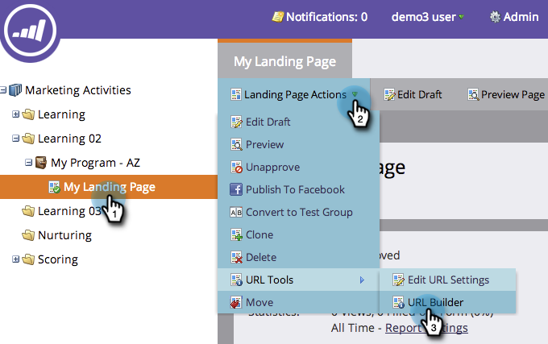

# De URL Builder gebruiken {#using-the-url-builder}

Met de URL Builder kunt u URL&#39;s maken die verborgen formuliervelden van Marketo kunnen vullen.

>[!PREREQUISITES]
>
>Leer hoe te om verborgen gebieden in vormen tot stand te brengen en hun montages in [&#x200B; uit te geven plaats een Gebied van de Vorm zoals Verborgen &#x200B;](/help/marketo/product-docs/demand-generation/forms/form-fields/set-a-form-field-as-hidden.md).

1. Selecteer een openingspagina, klik op **[!UICONTROL Landing Page Actions]**, houd de cursor boven **[!UICONTROL URL Tools]** en klik op **[!UICONTROL URL Builder]** .

   

1. Selecteer de velden die u wilt gebruiken, voer de waarde in en klik op **[!UICONTROL Update URL]** .

   

   >[!NOTE]
   >
   >Als u geen gebieden beschikbaar in de bouwer ziet, zorg ervoor dat uw vorm gebieden heeft verborgen en dat zij [&#x200B; worden geplaatst om Parameters URL &#x200B;](/help/marketo/product-docs/demand-generation/forms/form-fields/set-a-hidden-form-field-value.md#url-parameter) goed te keuren.

Geweldig werk! U kunt nu de URL kopiëren en plakken en deze op het web gebruiken.
