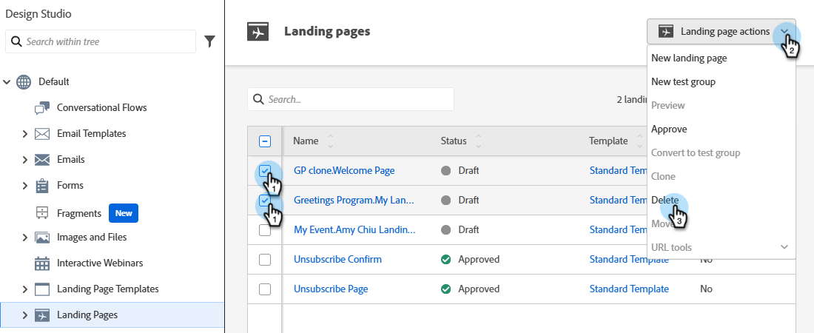

# Een bestemmingspagina goedkeuren, goedkeuren of verwijderen {#approve-unapprove-or-delete-a-landing-page}

De bestemmingspagina&#39;s zijn in ontwerpwijze tot u hen goedkeurt. Met Goedkeuring worden pagina&#39;s in de rest van het systeem beschikbaar gesteld. Wanneer u een goedgekeurde bestemmingspagina bewerkt, slaat Marketo Engage het concept op, maar blijft de goedgekeurde versie gebruiken totdat u het concept goedkeurt.

## Een bestemmingspagina goedkeuren {#approve-a-landing-page}

1. Selecteer de gewenste bestemmingspagina, klik en klik **[!UICONTROL Approve draft]**.

   

   >[!TIP]
   >
   >U hebt de capaciteit om veelvoudige pagina&#39;s in één keer [&#x200B; goed te keuren indien gewenst.](/help/marketo/product-docs/demand-generation/landing-pages/landing-page-actions/approve-multiple-landing-pages-at-once.md)

U kunt ook met de rechtermuisknop op de landingspagina in de linkernavigatiebalk klikken en **[!UICONTROL Approve]** selecteren.

>[!NOTE]
>
>Er is een groen vinkje toegevoegd aan een goedgekeurde landingspagina.

## Een bestemmingspagina niet goedkeuren {#unapprove-a-landing-page}

1. Selecteer de gewenste bestemmingspagina en klik **[!UICONTROL Unapprove]**.

   

U kunt ook met de rechtermuisknop op de landingspagina in de linkernavigatiebalk klikken en **[!UICONTROL Unapprove]** selecteren.

>[!NOTE]
>
>Uw niet-goedgekeurde bestemmingspagina wordt niet meer gepubliceerd op het web en genereert geen extra activiteiten. De bezoekers aan niet goedgekeurde het Bestaan Pagina&#39;s en hun Lusjes Facebook zullen de [&#x200B; Pagina van de Terugval &#x200B;](/help/marketo/product-docs/administration/settings/set-a-fallback-page.md) zien.

## Een bestemmingspagina verwijderen {#delete-a-landing-page}

1. Selecteer de gewenste bestemmingspagina. Klik op de vervolgkeuzelijst **[!UICONTROL Landing Page Actions]** en selecteer **[!UICONTROL Delete]** .

   

   >[!IMPORTANT]
   >
   >U kunt een goedgekeurde bestemmingspagina niet verwijderen. U moet het eerst afkeuren.

U kunt ook met de rechtermuisknop op de landingspagina in de linkernavigatiebalk klikken en **[!UICONTROL Delete]** selecteren.

## Meerdere bestemmingspagina&#39;s verwijderen {#delete-multiple-landing-pages}

1. Klik op [!UICONTROL Design Studio] in het hoofdscherm van **[!UICONTROL Landing Pages]** .

   

1. Selecteer de gewenste bestemmingspagina&#39;s. Klik op de vervolgkeuzelijst **[!UICONTROL Landing Page Actions]** en selecteer **[!UICONTROL Delete]** .

   

1. Klik op **[!UICONTROL Delete]** om te bevestigen.

   
