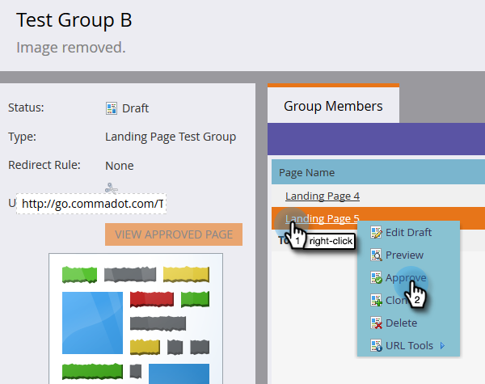

# Testgroepen voor landingspagina {#landing-page-test-groups}

Marketo houdt het aantal paginaweergaven en formulieraanvullen bij op elke geteste pagina in een testgroep. U kunt de resultaten van de testgroep gebruiken om te beslissen welke het landen Pagina het meest dwingende is. Hier is hoe te om een testgroep tot stand te brengen.

>[!PREREQUISITES]
>
>[&#x200B; bouwt twee of meer het landen pagina&#39;s &#x200B;](/help/marketo/getting-started/quick-wins/landing-page-with-a-form.md), bij voorkeur met een vorm.

1. Klik in de Design Studio op **[!UICONTROL New]** . Selecteer **[!UICONTROL New Test Group]** in het vervolgkeuzemenu.

   

   >[!NOTE]
   >
   >De andere manieren om een Groep van de Test te creëren zijn:
   >
   >* Klik met de rechtermuisknop op een openingspagina in de structuur en selecteer **[!UICONTROL Convert to Test Group]**
   >* Een testgroep voor landingspagina maken in een programma door **[!UICONTROL AB Test Group]** in het menu **[!UICONTROL New Local Asset]** te kiezen

1. Voer een naam en een optionele beschrijving in. Selecteer de bestemmingspagina&#39;s die u wilt testen en klik op **[!UICONTROL Create]** .

   

   >[!NOTE]
   >
   >Alleen niet-goedgekeurde bestemmingspagina&#39;s kunnen worden gekozen.

1. Klik met de rechtermuisknop op elke bestemmingspagina en selecteer **[!UICONTROL Approve]** .

   

1. Klik op de vervolgkeuzelijst **[!UICONTROL Test Group Actions]** en selecteer **[!UICONTROL Approve Test Group]** .

   

   Dat is het! U kunt nu statistieken van uw geselecteerde bestemmingspagina&#39;s vergelijken.

   

   >[!TIP]
   >
   >Als u de testgroep wilt verwijderen, klikt u gewoon op **[!UICONTROL Test Group Actions]** en selecteert u **[!UICONTROL Delete test group]** .
