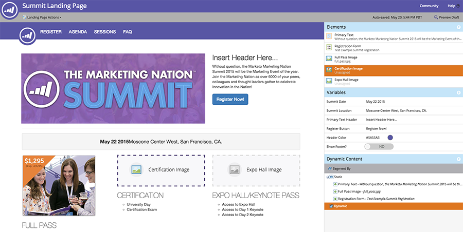

# Werken met vrije vorm en portaalpagina&#39;s met instructies {#understanding-free-form-vs-guided-landing-pages}

De sjabloon die u kiest, bepaalt in welke bewerkingsmodus voor de openingspagina u gaat werken. Er zijn twee mogelijke wegen: [ vrij-vorm ](/help/marketo/product-docs/demand-generation/landing-pages/free-form-landing-pages/create-a-free-form-landing-page.md) en [ geleid ](/help/marketo/product-docs/demand-generation/landing-pages/guided-landing-pages/create-a-guided-landing-page.md). Hieronder vindt u een korte samenvatting van de belangrijke verschillen.

## Vrije-vormpagina&#39;s {#free-form-pages}

* Sleep de gewenste inhoud naar de plaats waar u deze wilt plaatsen.
* De sjabloon is als een [!DNL SlideMaster] in [!DNL PowerPoint] , alleen een achtergrond.
* Maak een eenvoudige mobiele versie van uw pagina met een klik op een knop.
* Het beste wordt gebruikt wanneer u niet veel tijd of technische middelen tot uw beschikking hebt.

## Pagina&#39;s met instructies {#guided-pages}

* Vooraf gedefinieerde indeling/structuur die door de sjabloon wordt aangedreven.
* Alleen gebieden of variabelen die in de sjabloon als bewerkbaar zijn gedefinieerd, kunnen in de editor worden aangepast.
* Codewijzigingen die zijn vereist om de layout te wijzigen en aanvullende elementen toe te voegen.
* Kijk en voel over apparaat dat door regels wordt bepaald die in het malplaatje worden gebouwd.
* Deze optie kunt u het beste gebruiken als u responsieve sjablonen hebt gecodeerd of aangeschaft of als u een vooraf gebouwde Marketo-sjabloon wilt wijzigen.

