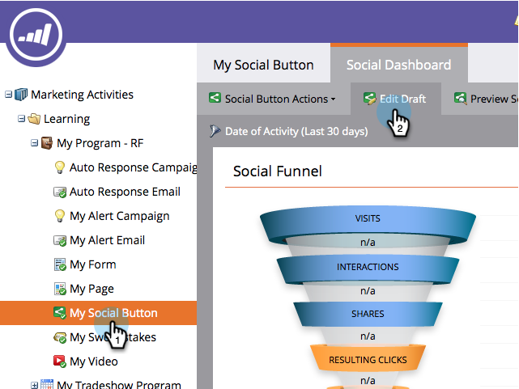

# After-Share-vragen configureren {#configure-after-share-prompts}

In apps voor sociale knoppen, video delen en opiniepeilingen kunt u kiezen wat er gebeurt nadat iemand uw inhoud op zijn sociale netwerk heeft gedeeld.

>[!IMPORTANT]
>
>Op 31 juli 2024 begonnen we met het afschaffen van deze functie. U kunt geen nieuwe elementen maken. Bestaande activa blijven werken tot 31 januari 2025. [ leer meer ](https://nation.marketo.com/t5/employee-blogs/marketo-engage-social-features-deprecation/ba-p/351977) {target="_blank"}

1. Ga naar **de Marketing Activiteiten**.

   

1. Selecteer app, en klik **uitgeven Ontwerp**.

   

1. In de sociale app redacteur, ga naar **Montages van de Toepassing** en dan **Geavanceerde Opties**.

   

1. Voor **na Aandeel**, selecteer het gedrag u wilt.

   

   * **Bericht van de Bevestiging:** Zodra de persoon heeft gedeeld, toon een bevestiging.
   * **E-mailVangst:** Zodra de persoon heeft gedeeld, verzoek hun e-mailadres.

   >[!NOTE]
   >
   >Als u **E-mailVangst** kiest, wordt het verzoek slechts getoond als de persoon niet reeds hun informatie heeft verstrekt.

1. Als u **Bericht van de Bevestiging koos:** ga naar **Stroom van het Aandeel** en toen **Bericht van de Bevestiging**.

   

1. Bewerk het bevestigingsbericht.

   

1. Als u **E-mailVangst** (in plaats van bevestiging) koos: Ga naar **Stroom van het Aandeel** en dan **E-mailVangst**.

   

1. Kies of om een marketing herinnering te omvatten, en of dat checkbox door gebrek wordt geselecteerd (**uit**) of niet (**Opt**).

   

1. Bewerk het verzoek om e-mailadres en de marketingvraag (als u deze hebt opgenomen).

   
