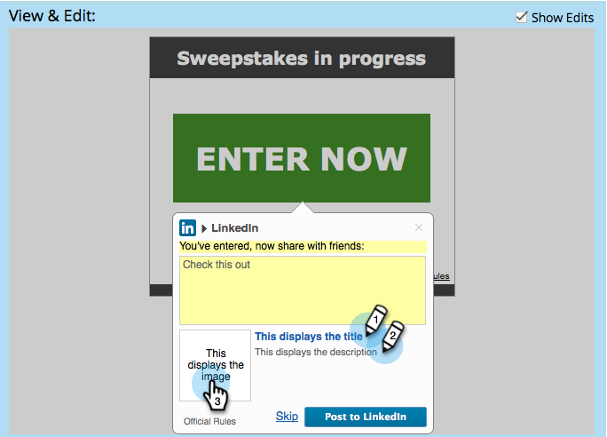

# Maatschappelijke aanmelding/workflow delen configureren {#configure-social-sign-up-share-flow}

Wanneer u een sociale app maakt, kunt u de keuzes voor het sociale netwerk configureren en aangeven dat een gebruiker een melding krijgt wanneer hij of zij zich aanmeldt.

>[!IMPORTANT]
>
>Op 31 juli 2024 begonnen we met het afschaffen van deze functie. U kunt geen nieuwe elementen maken. Bestaande activa blijven werken tot 31 januari 2025. [ leer meer ](https://nation.marketo.com/t5/employee-blogs/marketo-engage-social-features-deprecation/ba-p/351977) {target="_blank"}

## Netwerken selecteren voor delen {#select-networks-for-sharing}

1. Ga naar **de Marketing Activiteiten**.

   

1. Selecteer app, en klik **uitgeven Ontwerp**.

   

1. In de sociale app redacteur, klik **Teken-op Stroom** > **Sociale Netwerken**.

   

1. Selecteer (of verwijder) de netwerken een persoon aan kan delen.

   

## Facebook-bericht configureren {#configure-the-facebook-message}

1. Ga naar **Sign-Up Stroom** > **Berichten van het Aandeel**.

   

1. Configureer het bericht dat in Facebook-berichten wordt weergegeven.

   

   >[!NOTE]
   >
   >In een gedeelde video wordt de miniatuur automatisch gegenereerd.

   Als u **kiest voeg Dynamische inhoud** toe, worden de waarden van de 2} OpenGraph **markeringen van de pagina (og:titel, ga:titel, en ga:beschrijving) en de duimnagel automatisch toegevoegd aan de posten van Facebook.** Zie de volgende stap.

   Als u **kiest voeg Statische inhoud** toe, ga de titel, de titel, de beschrijving in, en upload een beeld. Zie de volgende twee stappen.

1. In het venster van de Mening &amp; geeft uit, klik **geeft uit** en geeft de aandeelherinnering en het bericht uit dat in de posten van Facebook zullen verschijnen.

   >[!TIP]
   >
   >Voor meer informatie, zie [ de Rijke Montages van Post van Facebook ](/help/marketo/product-docs/demand-generation/facebook/edit-facebook-rich-post-settings.md) uitgeven.

   

   >[!NOTE]
   >
   >Het [ aandeel URL ](/help/marketo/product-docs/demand-generation/social/social-functions/choose-the-share-url-for-a-social-app.md) wordt automatisch toegevoegd aan alle aandeelberichten.

1. Als u **koos voeg Statische inhoud** hierboven toe, geef de titel, de titel, de titel, en de beschrijving uit, en upload een douanebeeld (van uw [**Beelden en Dossiers van Marketo**](/help/marketo/product-docs/demand-generation/images-and-files/add-images-and-files-to-marketo.md)).

   

   Zie [ Afbeeldingen en Dossiers aan Marketo ](/help/marketo/product-docs/demand-generation/images-and-files/add-images-and-files-to-marketo.md) toevoegen.

   >[!NOTE]
   >
   >Als u een afbeelding uploadt, wordt deze hier pas weergegeven wanneer u de editor voor de sociale app sluit en weer opent.

1. Klik **daarna**.

Als u de waarden van de paginatags (og:title, og:caption en og:description) kiest, worden de miniaturen automatisch toegevoegd aan Facebook-posts. Zie de volgende stap.

## Het bericht Twitter configureren {#configure-the-twitter-message}

1. Bewerk de gedeelde vraag en het bericht dat worden weergegeven in Twitter-tweets.

   

   >[!TIP]
   >
   >Gebruik {html_title} in de tweetekst om automatisch de titel van de pagina weer te geven.

1. Klik **daarna**.

## LinkedIn-bericht configureren {#configure-the-linkedin-message}

1. Configureer het bericht dat in LinkedIn-berichten wordt weergegeven.

   

   Als u **kiest voeg Dynamische inhoud** toe, worden de waarden van de paginatags (titel en beschrijving), en de duimnagel, automatisch toegevoegd aan de posten van LinkedIn. Zie de volgende stap.

   Als u **kiest voeg Statische inhoud** toe, ga de titel, de titel, de titel, en de beschrijving in, en upload een beeld. Zie de volgende twee stappen.

1. In het **Mening &amp; geeft** venster uit, klik **geeft** uit en geeft de aandeelherinnering en het bericht uit dat in LinkedIn posten zullen verschijnen.

   

   >[!TIP]
   >
   >Gebruik {html_title} in de berichttekst om de titel van de pagina automatisch weer te geven.

1. Als u **kiest voeg Statische inhoud** hierboven toe, geef de titel en de beschrijving uit, en upload een douanebeeld (van uw [**Beelden en Dossiers van Marketo**](/help/marketo/product-docs/demand-generation/images-and-files/add-images-and-files-to-marketo.md)).

   

>[!NOTE]
>
>Als u een afbeelding uploadt, wordt deze hier pas weergegeven wanneer u de editor voor de sociale app sluit en weer opent.

>[!MORELIKETHIS]
>
>Daarna, kunt u **Afwerking** klikken > **goedkeuren en sluit** en uw sociale app op een het landen pagina zetten. U kunt [ persoon ook vormen vangt ](/help/marketo/product-docs/demand-generation/social/configuring-social-actions/configure-person-capture-for-a-social-app.md) of [ herdeel herinnering ](/help/marketo/product-docs/demand-generation/social/configuring-social-actions/configure-re-share-email-and-prompt-for-a-social-app.md).
