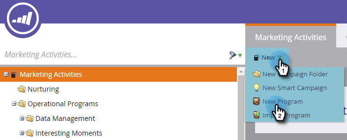
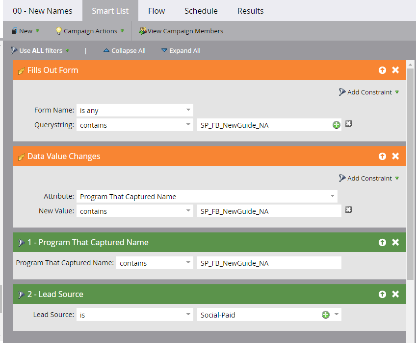
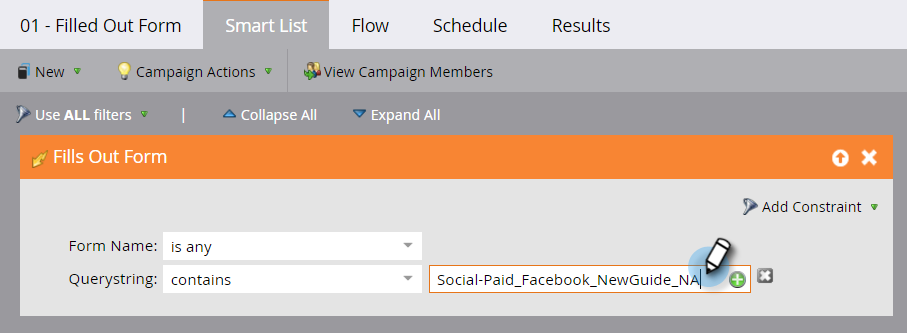

# Ontvangsten toewijzen voor digitale reclamecampagnes {#set-up-revenue-attribution-for-digital-advertising-campaigns} instellen

Hieronder wordt beschreven hoe u inkomstentoewijzing voor digitale reclamekanalen en campagnes instelt. Nadat u het hebt opgezet, kunt u eerste-aanraak en multi-aanraking opbrengstattributie voor digitale advertenties doen het zelfde als in andere programma&#39;s van de Marketo.

Nadat u het eerste advertentieprogramma hebt ingesteld in Marketo, kunt u het klonen en bijwerken voor andere kanalen. U kunt bijvoorbeeld een LinkedIn-programma klonen naar een Facebook-programma.

Met afzonderlijke programma&#39;s, kunt u dan het aantal omzettingen van elkaar volgen en uw programma&#39;s in de Analysator van het Programma, de Analysator van de Invloed van de Mogelijkheid, en andere eigenschappen van de Analyse van de Marketo zien.

>[!PREREQUISITES]
>
>* Een kanaaltag instellen met statuswaarden en succes van programma (bijvoorbeeld Digital Advertising of Social Paid en PPC)
>* Een formulier maken of bewerken om een queryreeks door te geven aan de persoon
>* Zorg ervoor dat u toegang hebt tot bepaalde mogelijkheden voor de analyse van de opbrengstcyclus om te rapporteren over uw advertentiekanalen en campagnes

## Een standaardprogramma maken {#create-a-default-program}

In tegenstelling tot sommige programma&#39;s (zoals e-mail) die periodiek voor een bepaalde periode kunnen lopen, zijn de standaardprogramma&#39;s altijd ingeschakeld.

1. Ga naar **Marketingactiviteiten**.

   

1. Klik **Nieuw** en selecteer **Nieuw Programma**.

   

1. Als u al een programma op zijn plaats hebt, kunt u [het ](/help/marketo/product-docs/core-marketo-concepts/programs/working-with-programs/clone-a-program.md) klonen.

   >[!TIP]
   >
   >Wanneer u een programma kloont, ben zeker om de namen in de gebieden van het vraagkoord van de slimme lijsten te vervangen.

1. Plaats het nieuwe programma in een specifieke campagneomslag, nadat het aanvankelijke programma wordt geplaatst.

   >[!NOTE]
   >
   >**Voorbeeld**
   >
   >Een queryreeks die via de URL wordt doorgegeven, helpt Marketo te weten op welke advertentiecampagne iemand klikte toen hij een persoon werd in Marketo.
   >
   >U kunt een methodologie van het vraagkoord tot stand brengen die alle variabelen omvat u wilt meten. Marketo gebruikt deze variabelen om mensen aan uw verschillende programma&#39;s toe te voegen.
   >
   >U kunt bijvoorbeeld Kanaaltype_Channel__Asset__Region gebruiken. Dat zou er als volgt kunnen uitzien: SP_FB_NewGuide_US. **Opmerking**: afkortingen besparen ruimte.
   >
   >Of stel de waarde in als Channel_Adsource_AssetName_Region_UniqueIdNumber. Dat zou er als volgt kunnen uitzien: Social-Paid_Facebook_NewGuide_NA_123.

## Een slimme campagne maken voor nieuwe namen {#create-a-smart-campaign-for-new-names}

1. Maak in de slimme campagne een slimme lijst met twee triggers en twee filters, zoals weergegeven.

   

   >[!NOTE]
   >
   >De vraagtekenreeks die in de twee triggers wordt gebruikt en het filter **Programma met vastgelegde naam** is uniek voor u. De hier weergegeven querytekenreeksen zijn bijvoorbeeld alleen. Als u het veld hebt gekloond, vervangt u deze velden gewoon.

1. Creeer een stroomstap om de attributen in **Programma van de Aankoop te veranderen** en de Nieuwe Waarde te plaatsen aan de waarde u voor betaalde sociale campagnes hebt bepaald.

   

1. Plan en activeer de campagne.

## Creeer een Slimme Campagne voor Status/het Succes van het Programma {#create-a-smart-campaign-for-status-program-success}

U hebt een tweede slimme campagne nodig om de status van mensen te wijzigen, zodat ze het succes van het programma kunnen bereiken en kunnen worden opgenomen in berekeningen voor inkomstentoewijzing.

1. Voer in de trigger **Formulier** invullen de naam van het programma in de queryreeks in. Als u het programma kloont, vervang enkel de oude naam van het vraagkoord met nieuwe.

   

1. Stroom maken om de status te wijzigen in een stap die aan het succes van het programma is gekoppeld.

   

   >[!NOTE]
   >
   >Het bovenstaande voorbeeld toont **Omgezet**, maar dit hangt van uw status/succeswaarden af.

1. Plan en activeer de campagne.

## Advertentie {#create-your-ad} maken

Nadat u het programma en de campagnes hebt ingesteld, maakt u de nieuwe advertentie.

1. Ga naar het kanaal; bijv. LinkedIn of Facebook.
1. Maak een nieuwe advertentie.
1. Selecteer een Marketo-landingspagina als een bestemming voor de oproep tot actie in de campagne.
1. Voeg de queryreeks toe aan de URL.

   >[!NOTE]
   >
   >**Voorbeeld**
   >
   >Hieronder wordt beschreven hoe u alle informatie die u hebt ingesteld, kunt toevoegen aan een werkelijke URL. De items worden gescheiden door een en-teken (&amp;):
   >
   >`www.marketo.com?**source**=Social-Paid&**comment**=Social-Paid_Facebook_NewGuide_NA&**camp**=abc&**kk=**xyz`
   >
   >* **De bron** is de Persbron die als kanaal-id wordt gebruikt
   >* **plaatst** opmerkingen bij de unieke id die voor elk programma is gemaakt
   >* **De** campis de campagne in Facebook, LinkedIn of Google
   >* **** weet het trefwoord of de elementnaam die u wilt vastleggen

   >
   >**Deze vier termen moeten allemaal in kleine letters staan en de URL mag geen spaties bevatten om deze gegevens vast te leggen.**

## Aanbevolen procedures {#best-practices}

Gebruik één kanaalmarkering om alle digitale reclame te vertegenwoordigen, of gebruik veelvoudige kanaalmarkeringen als u meer korrelige vergelijkingen met uw andere marketing kanalen (bijvoorbeeld, sociaal-Betaalde, Onderzoek-Betaalde, Vertoning, het Terugkeren) wilt.

Stel vervolgens verschillende programma&#39;s in voor elke rapportweergave die u nodig hebt. Gebruik een gemeenschappelijke identiteitskaart als parameter in URL (BC, bijvoorbeeld) in het vraagkoord als u 10 gebieden hebt die een &quot;Grote Campagne&quot;samen lanceren en resultaten over gebieden willen kunnen bekijken.

Als u over elke regio en de collectieve resultaten van de Grote Campagne wilt rapporteren, creeer 11 programma&#39;s-voor elke regio en één voor de Grote Campagne. Elk programma verwijst slechts de relevante karakters van het vraagkoord (zoals BC).

Er is opzettelijke overlapping in het aantal personen tussen de programma&#39;s van de Grote Campagne en de regio, dus je zou niet willen rapporteren over het totale aantal mensen in alle 11 programma&#39;s, aangezien sommige mensen zowel in de Grote Campagne als in een van de programma&#39;s van de regio zitten.
