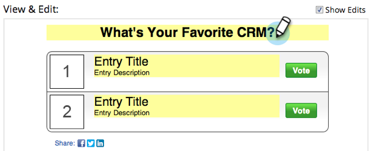

# Een opiniepeiling maken {#create-a-poll}

Betaal mensen met een opiniepeiling die ze kunnen inbrengen en deel ze met hun vrienden op sociale netwerken. U kunt deze toevoegen aan plaatsen als uw bestemmingspagina&#39;s, uw website en Facebook.

>[!IMPORTANT]
>
>Op 31 juli 2024 begonnen we met het afschaffen van deze functie. U kunt geen nieuwe elementen maken. Bestaande activa blijven werken tot 31 januari 2025. [ leer meer ](https://nation.marketo.com/t5/employee-blogs/marketo-engage-social-features-deprecation/ba-p/351977) {target="_blank"}

>[!PREREQUISITES]
>
>Als u afbeeldingen in uw opiniepeiling wilt gebruiken, voegt u deze toe aan uw Marketo-bibliotheek met afbeeldingen en bestanden voordat u begint. Voeg een afbeelding van 60 x 60 px toe voor elk opiniepeilingitem. Zie [ Afbeeldingen en Dossiers aan Marketo ](/help/marketo/product-docs/demand-generation/images-and-files/add-images-and-files-to-marketo.md) toevoegen.

1. Binnen uw programma, uitgezochte **Nieuw** > **Nieuwe Lokale Activa**.

   

1. In de **Lokale Galerie van Activa**, klik **Opiniepeiling**.

   

1. Geef uw opiniepeiling een naam.

   

   >[!TIP]
   >
   >Om tijd te besparen, kunt u de **Kloon van** optie gebruiken om alle montages van een bestaand videoaandeel te kopiëren.

1. Geef uw opiniepeiling een kop (meestal een korte vraag).

   

1. Bewerk voor elk item de titel en de beschrijving.

   

1. Als u een item wilt toevoegen, klikt u op het symbool **+** en bewerkt u de titel en beschrijving.

   

1. Voor elk item kunt u een afbeelding toevoegen door op de genummerde miniatuur te klikken.

   

1. Selecteer het beeld u nodig hebt, dan klik **Uitgezocht**.

   

1. Wanneer u de duimnagel, de titel, en de beschrijving voor alle ingangen hebt geplaatst, klik **Afwerking**.

   

1. Klik **goedkeuren** en **Sluiten.**

   

De opiniepeilingseditor wordt in een nieuw venster geopend. De standaardinstellingen zijn allemaal goed, maar u moet nog wel uw opiniepeilinggegevens toevoegen. In de volgende stappen laten we u zien hoe u dat doet.

>[!TIP]
>
>Om om het even welke gebreken in uw opiniepeiling te veranderen, klik **terug**. Om uw werk voor later te bewaren zonder goed te keuren, klik **dicht**.

Als er problemen zijn in de opiniepeiling, wordt u gevraagd deze te verhelpen voordat de opiniepeiling wordt goedgekeurd.

>[!IMPORTANT]
>
>Een opiniepeiling kan niet meer worden bewerkt nadat een stemming is ingediend.

>[!MORELIKETHIS]
>
>De volgende stap moet [ uw opiniepeiling ](/help/marketo/product-docs/demand-generation/social/creating-a-poll/publish-a-poll.md) publiceren, maar u kunt de montages van uw opiniepeiling indien nodig veranderen. Begin met [ het aanpassen van de opiniepeilingsmontages ](/help/marketo/product-docs/demand-generation/social/creating-a-poll/customize-poll-settings.md).
