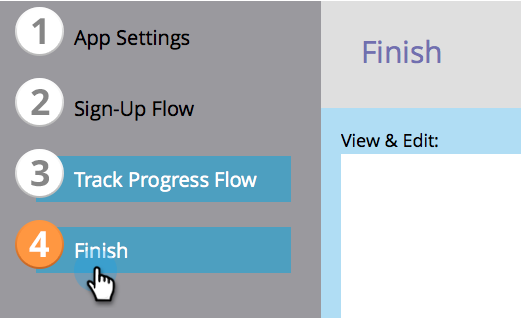

# Verwijzingsvoorstel maken {#create-a-referral-offer}

Verwijzing biedt mensen een prikkel om hun vrienden te raadplegen. Creëer doelstellingen en beloningen voor succesvolle verwijzingen. U kunt het op bestemmingspagina&#39;s, uw website, en zelfs Facebook laten vallen.

>[!IMPORTANT]
>
>Op 31 juli 2024 begonnen we met het afschaffen van deze functie. U kunt geen nieuwe elementen maken. Bestaande activa blijven werken tot 31 januari 2025. [ leer meer ](https://nation.marketo.com/t5/employee-blogs/marketo-engage-social-features-deprecation/ba-p/351977) {target="_blank"}

>[!AVAILABILITY]
>
>Niet alle gebruikers van het Marketo Engage hebben deze functionaliteit aangeschaft. Neem contact op met het accountteam van de Adobe (uw accountmanager) voor meer informatie.

1. Binnen uw programma, uitgezochte **Nieuw** > **Nieuwe Lokale Activa**.

   

1. In de **Lokale Galerij van Activa**, klik **Verwijzing Aanbieding**.

   

1. Geef een naam op voor uw verwijzingsvoorstel.

   

   >[!TIP]
   >
   >Om tijd te besparen, kunt u de **Kloon van** optie gebruiken om alle montages van een bestaande verwijzingsaanbieding te kopiëren.

   De verwijzingsaanbiedingsredacteur opent in een nieuw venster. De standaardinstellingen zijn allemaal goed, maar u moet een koppeling toevoegen aan de regels van uw aanbieding (voorwaarden). De koppeling wordt onder in de berichtvensters voor delen weergegeven. In de volgende stap tonen we u hoe.

1. Klik **Geavanceerde Opties**.

   

1. Voeg een koppeling toe naar de regels van je voorstel. Ga **URL** in.

   

   >[!NOTE]
   >
   >Op dit scherm kunt u ook een koppeling naar het privacybeleid toevoegen. Zie [ Uw Beleid van de Privacy aan een Sociale app ](/help/marketo/product-docs/demand-generation/social/social-functions/add-your-privacy-policy-to-a-social-app.md) toevoegen.

1. Klik **Afwerking**.

   

1. Klik **goedkeuren en sluiten**.

   >[!TIP]
   >
   >Om om het even welke gebreken in uw verwijzingsaanbieding te veranderen, klik **terug**. Om uw werk voor later te bewaren zonder goed te keuren, klik **dicht**.

   

Als er problemen zijn in het verwijzingsaanbod, wordt u gevraagd deze aan te pakken voordat het voorstel wordt goedgekeurd.

Gefeliciteerd! Je hebt je verwijzingsvoorstel gemaakt.

>[!NOTE]
>
>Alle standaardinstellingen, tekenreeksen en berichten kunnen worden gewijzigd.

>[!MORELIKETHIS]
>
>De volgende stap moet [ uw verwijzingsaanbieding ](/help/marketo/product-docs/demand-generation/social/referral-offers/publish-a-referral-offer.md) op een het landen pagina, op uw website, of op Facebook publiceren.
