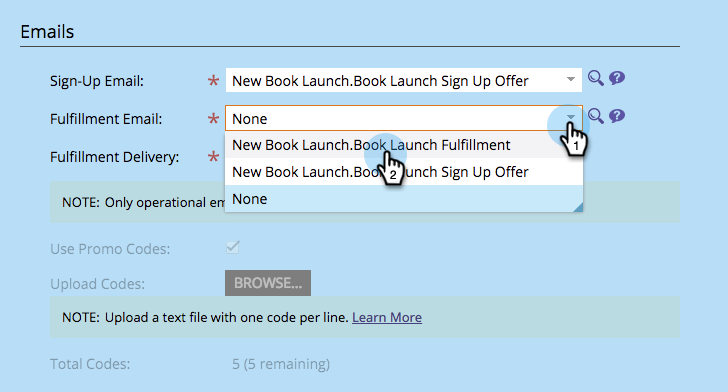

# Verzenden van e-mail met uitvoeringsvoorstel voor verwijzing {#send-referral-offer-fulfillment-email}

Geef uw klanten coupons en kortingscodes terug met behulp van het e-mailbericht dat aan de aanbieding wordt voldaan.

>[!IMPORTANT]
>
>Op 31 juli 2024 begonnen we met het afschaffen van deze functie. U kunt geen nieuwe elementen maken. Bestaande activa blijven werken tot 31 januari 2025. [ leer meer ](https://nation.marketo.com/t5/employee-blogs/marketo-engage-social-features-deprecation/ba-p/351977) {target="_blank"}

>[!PREREQUISITES]
>
>* [ Emails van het Gebruik in Sociale Bevorderingen ](/help/marketo/product-docs/demand-generation/social/social-functions/use-emails-in-social-promotions.md)
>* [ creeer een Verwijzing Aanbod ](/help/marketo/product-docs/demand-generation/social/referral-offers/create-a-referral-offer.md)

## Afhandeling van tegoeden instellen {#set-up-fulfillment-delivery}

1. Selecteer het verwijzingsaanbod. Klik **uitgeven Ontwerp**.

   

1. Onder **de Montages van de Toepassing**, uitgezochte **Details van de Aanbieding**.

   

1. Selecteer a **Teken-op-mail**.

   

1. Selecteer e-mail van de a **Afhandeling**.

   

   >[!NOTE]
   >
   >Leer meer over [ gebruikend e-mails in sociale bevorderingen ](/help/marketo/product-docs/demand-generation/social/social-functions/use-emails-in-social-promotions.md).

1. Klik de **drop-down Levering van de Uitvoering** en selecteer **auto op doel**.

   

   Het bericht binnen **wordt geselecteerd die e-mail van de Uitvoering** zal automatisch worden verzonden naar mensen die het doel ontmoeten.

## Handmatig verzenden {#manual-send}

U kunt een e-mailbericht voor vervulling handmatig naar een persoon sturen zodra deze het doel heeft bereikt.

1. Selecteer de verwijzingsaanbieding en klik de **Deelnemers** tabel.

   

1. Klik de **Filter door** optie en selecteer **Doel**.

   >[!NOTE]
   >
   >Hiermee selecteert u mensen die het doel van het verwijzingsaanbod hebben bereikt.

   

1. Selecteer de personen in de gefilterde weergave.

   

1. Klik met de rechtermuisknop en selecteer **E-mail over afhandeling verzenden** .

   

Geweldig! Deze mensen zullen nu de afhandeling per e-mail ontvangen en over hun beloning worden gearchiveerd.
