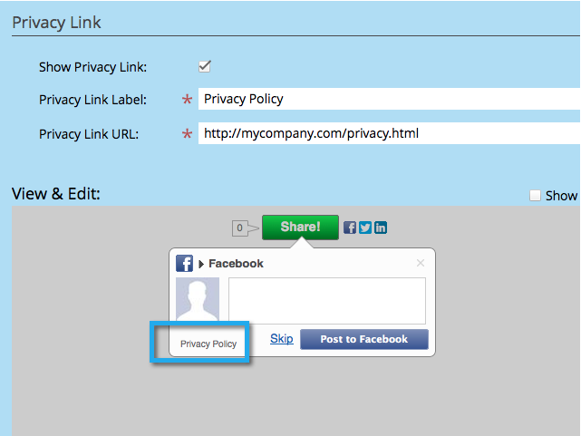

# Uw privacybeleid toevoegen aan een sociale app {#add-your-privacy-policy-to-a-social-app}

Wanneer u een sociale app maakt, kunt u een koppeling toevoegen aan het privacybeleid van uw bedrijf.

>[!IMPORTANT]
>
>Op 31 juli 2024 begonnen we met het afschaffen van deze functie. U kunt geen nieuwe elementen maken. Bestaande activa blijven werken tot 31 januari 2025. [ leer meer ](https://nation.marketo.com/t5/employee-blogs/marketo-engage-social-features-deprecation/ba-p/351977) {target="_blank"}

1. Ga naar **de Marketing Activiteiten**.

   

1. Selecteer app, en klik **uitgeven Ontwerp**.

   

1. In de sociale app redacteur, ga naar **Montages van de Toepassing** > **Geavanceerde Opties**.

   

1. Als u een koppeling naar uw privacybeleid wilt toevoegen, schakelt u het selectievakje in, bewerkt u de titel en voert u de URL in.

   

   >[!NOTE]
   >
   >Op dit scherm kunt u ook een koppeling toevoegen naar de regels (voorwaarden) van uw aanbieding. Zie [ een Verwijzing aanbieden ](/help/marketo/product-docs/demand-generation/social/referral-offers/create-a-referral-offer.md) creëren.

1. De verbinding van het privacybeleid (en de regelsverbinding) zal in de bodem van de schermen van het aandeelbericht verschijnen. Bijvoorbeeld:

   

Daarna, kunt u [ de sociale aanmelding vormen en stroom delen ](/help/marketo/product-docs/demand-generation/social/configuring-social-actions/configure-social-recommend-flow.md) van uw app.
