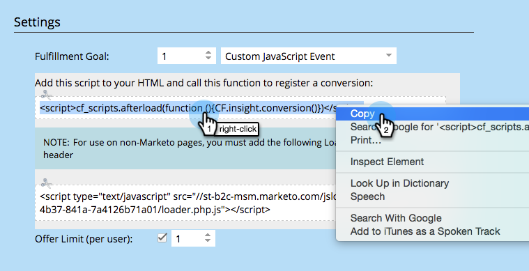

# Conversiescript voor aangepaste gebeurtenissen {#conversion-script-for-custom-events}

U bepaalt het doel van de vervulling wanneer het creëren van een verwijzingsaanbieding. Als de actie die telt om het doel te bereiken een specifieke gebeurtenis op uw eigen Web-pagina is, kunt u een omzettingsmanuscript gebruiken om onze JavaScript API te roepen.

>[!IMPORTANT]
>
>Op 31 juli 2024 begonnen we met het afschaffen van deze functie. U kunt geen nieuwe elementen maken. Bestaande activa blijven werken tot 31 januari 2025. [ leer meer ](https://nation.marketo.com/t5/employee-blogs/marketo-engage-social-features-deprecation/ba-p/351977) {target="_blank"}

## Conversiescript ophalen {#retrieve-the-conversion-script}

1. Binnen de verwijzingsaanbiedingsredacteur, klik **Details van de Aanbieding** en selecteer dan de **Gebeurtenis van JavaScript van de Klant** van de drop-down van het uitvoeringsdoel.

   

1. Kopieer het bovenste script in het grijze vak en plaats het binnen de `<body>` -tags op de webpagina. Het onderste script wordt binnen de `<header>` -tags geplaatst.

   

   >[!NOTE]
   >
   >Vergeet niet beide scripts te kopiëren en te plakken als ze naar een niet-Marketo-website gaan.

## Het Loader-script ophalen {#retrieve-the-loader-script}

1. Selecteer de verwijzingsaanbieding van de boom, dan klik {de Acties van het Verwijzing van 0} **en** bed Code **in.**

   

1. Klik de **Code van de Kopbal** met de rechtermuisknop aan en neem het in uw webpaginakopbal op. Dan doe het zelfde voor de **Code van het Lichaam**.

   

## Scripts op uw webpagina plakken {#pasting-the-scripts-onto-your-webpage}

Plak de conversiescripts in de HTML voor de hoofdtekst en koptekst. Plaats vervolgens de lader-scripts in de HTML voor de hoofdtekst en koptekst.

## Conversiescript verbinden {#connecting-the-conversion-script}

Hier schrijft u een JavaScript-functie die de specifieke HTML-id gebruikt van elk pagina-element waarop u de voltooiing van het doel wilt activeren. Bijvoorbeeld:

`<pre><em><!-- Referral offer conversion script --></em> </pre>` `<pre>`

In dit voorbeeld bevindt zich een knop op de webpagina met de id &quot;#myButtonId&quot;. Wanneer op die knop wordt geklikt, wordt de persoon geregistreerd dat hij het doel heeft bereikt.

Geweldig! Op uw website worden nu aangepaste doelen voor sociale bevordering vastgelegd met Marketo.

>[!MORELIKETHIS]
>
>* [ specificeer Doel voor Verwijzing Aanbieding ](/help/marketo/product-docs/demand-generation/social/referral-offers/specify-goal-for-referral-offer.md)
>* [ creeer een Verwijzing Aanbod ](/help/marketo/product-docs/demand-generation/social/referral-offers/create-a-referral-offer.md)
>* [ stel Sociaal op Uw Website ](/help/marketo/product-docs/demand-generation/social/social-functions/deploy-social-on-your-website.md) op
