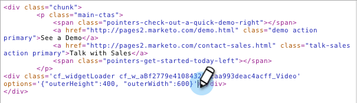

# Sociaal op uw website implementeren {#deploy-social-on-your-website}

Sociale apps insluiten op niet-Marketo-pagina&#39;s.

>[!IMPORTANT]
>
>Op 31 juli 2024 begonnen we met het afschaffen van deze functie. Er kunnen geen nieuwe elementen meer worden gemaakt. Bestaande activa blijven werken tot 31 januari 2025. [ leer meer ](https://nation.marketo.com/t5/employee-blogs/marketo-engage-social-features-deprecation/ba-p/351977) {target="_blank"}

>[!AVAILABILITY]
>
>Niet alle gebruikers van het Marketo Engage hebben deze functionaliteit aangeschaft. Neem contact op met het accountteam van de Adobe (uw accountmanager) voor meer informatie.

U kunt sociale apps op uw eigen website opstellen om uw publiek te betrekken en iedereen in het grotere gesprek op sociale netwerken te brengen. Wanneer mensen uw aanbiedingen en inhoud delen met hun vrienden op sociale netwerken, genereert u meer verkeer op uw site.

1. Selecteer een goedgekeurde sociale app, zoals een YouTube Video of Social Button.

   

1. Selecteer **bed Code** van de Acties van de Sociale Toepassing in.

   

1. Kopieer de code voor de paginakoptekst (`<head>`) en de hoofdtekst (`<body>`) van uw site.

   

1. Plak het eerste codefragment in de paginakoptekst van uw website.

   

1. Plak het tweede codefragment in elke pagina waar u de sociale app op de pagina wilt weergeven.

   

1. Als u de grootte van sociale app aan specifieke afmetingen op uw pagina moet plaatsen, voeg **outerHeight** en **outerWidth** opties aan het tweede codefragment toe. U kunt bijvoorbeeld `options='{"outerHeight":400, "outerWidth":600}'` toevoegen, zoals in:

   

   Uw sociale Marketo-app voegt nu inhoud en interactiviteit toe aan uw website, en nodigt fans, bezoekers en bestaande klanten uit om het woord over u te verspreiden. Tegelijkertijd worden hun profielgegevens toegevoegd aan uw database en worden de maatstaven voor sociale invloed bijgehouden.

   >[!MORELIKETHIS]
   >
   >* [ pas Sociale App Knoop ](/help/marketo/product-docs/demand-generation/social/configuring-social-actions/customize-social-app-button.md) aan
   >* [ plaats de Vereiste van het Sociale Aandeel ](/help/marketo/product-docs/demand-generation/social/social-functions/set-social-share-requirement.md)
   >* [ Publish die Pagina&#39;s aan Facebook ](/help/marketo/product-docs/demand-generation/facebook/publish-landing-pages-to-facebook.md) landt
