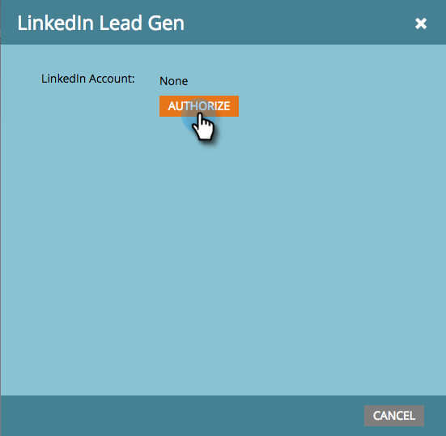

# LinkedIn Gen Forms instellen {#set-up-linkedin-lead-gen-forms}

Gebruik LinkedIn Gen Forms om advertentiecampagnes in LinkedIn uit te voeren en leads voor Marketo te genereren.

>[!NOTE]
>
>* **Vereiste Bevoegdheden Admin**
>
>* Zorg ervoor dat de formuliernaam bij het maken van LinkedIn Lead Gen-formulieren niet alleen numerieke tekens bevat. De formuliernaam moet alfabetisch of alfanumeriek zijn.
>
>* Een LinkedIn lood zal niet in Marketo Engage komen als het een bestaand persoonverslag in Marketo aanpast dat met een bedrijfverslag verbonden is dat gebruikend Bedrijf APIs wordt gecreeerd, en het abonnement van Marketo wordt niet verbonden met een CRM.

1. Ga naar het **[!UICONTROL Admin]** -gebied.

   

1. Ga naar **[!UICONTROL LaunchPoint]** , klik op **[!UICONTROL New]** en selecteer **[!UICONTROL New Service]** .

   

1. Ga a _Naam van de Vertoning_ voor uw dienst in, selecteer de **[!UICONTROL LinkedIn Lead Gen]** dienst van drop-down, en klik **[!UICONTROL Next]**.

   

1. Marketo opent een nieuw lusje in zelfde browser aan [ linkedin.com ](https://www.linkedin.com){target="_blank"}. Meld u aan bij LinkedIn met het account dat u voor de integratie wilt gebruiken.

   >[!NOTE]
   >
   >De LinkedIn-account heeft toegang nodig tot alle LinkedIn Business Accounts waarvoor u gesponsorde campagnes maakt.

   

1. Nadat u zich hebt aangemeld bij LinkedIn, keert u terug naar Marketo en klikt u op **[!UICONTROL Authorize]** .

   

1. Klik wanneer u daarom wordt gevraagd op **[!UICONTROL Allow]** om de installatie van de Marketo-toepassing in LinkedIn te accepteren.

   

1. Je ziet dat je nu geautoriseerd bent. Klik op **[!UICONTROL Next]**.

   

   >[!CAUTION]
   >
   >De dienst verloopt automatisch één jaar na vergunning. Klik op **[!UICONTROL Re-Authorize]** om de toegang te herstellen. U kunt uw wachtwoord LinkedIn, afhankelijk van uw browser montages moeten opnieuw ingaan.

1. Selecteer de account(s) waaruit LinkedIn lead Gen naar Marketo moet komen en klik op **[!UICONTROL Next]** .

   >[!TIP]
   >
   >Als u niet de BedrijfsRekeningen ziet die u verwacht, zorg ervoor dat de rekening LinkedIn van de gebruiker die wordt gemachtigd Leider de Toestemmingen van de Manager van de Vorm aan de BedrijfsRekening in LinkedIn heeft.

   

1. Als u standaardtoewijzingen van LinkedIn naar Marketo-velden wilt accepteren, klikt u gewoon op **[!UICONTROL Create]** . Als u de standaardveldtoewijzing wilt wijzigen, een veldtoewijzing wilt verwijderen of een nieuwe veldtoewijzing wilt toevoegen, kunt u dit per veld doen via de onderstaande modus.

   >[!CAUTION]
   >
   >Marketo steunt afbeelding twee gebieden LinkedIn aan één enkel gebied van Marketo, _maar slechts wanneer_ de twee gebieden LinkedIn niet op de zelfde vorm zijn. Als u twee velden van hetzelfde LinkedIn-formulier toewijst aan één Marketo-veld, kunnen mensen uw Marketo-database niet invoeren.

   

   >[!NOTE]
   >
   >Slechts zullen de gebieden LinkedIn die reeds aan a [ vormmalplaatje ](https://www.linkedin.com/help/lms/answer/79634){target="_blank"} in Manager LinkedIn van de Campagne zijn bewaard verschijnen als Gebieden LinkedIn die aan de gebieden van Marketo kunnen worden in kaart gebracht.

   

Echt waar! Personen die LinkedIn Gen-formulieren indienen, gaan naar Marketo wanneer u succesvolle campagnes voert aan de LinkedIn-zijde.

>[!NOTE]
>
>U kunt slechts één LinkedIn-gebruikersaccount autoriseren. Als u meerdere zakelijke accounts hebt die u aan Marketo wilt koppelen, moet u ervoor zorgen dat de LinkedIn-account van de gebruiker die wordt geautoriseerd, leid-Gen Form Manager-machtigingen heeft voor de Business Account in LinkedIn.

>[!MORELIKETHIS]
>
>[ Gebruik LinkedIn de Filters en de Trekkers van de Vorm van de Leider van de Leider in een Slimme Campagne ](/help/marketo/product-docs/demand-generation/social/social-functions/use-linkedin-lead-gen-form-filters-and-triggers-in-a-smart-campaign.md){target="_blank"}
