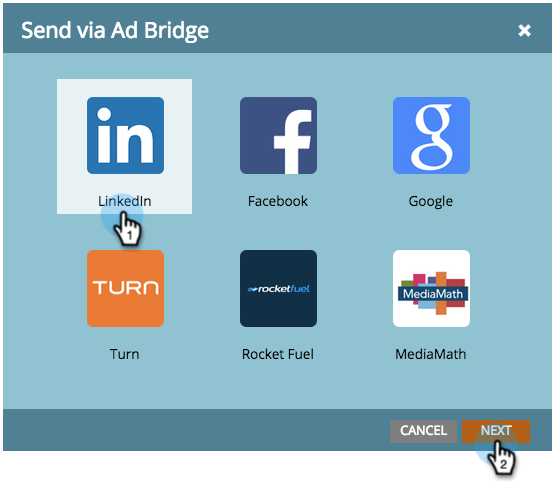

# Een Marketo-lijst of slimme lijst gebruiken als een LinkedIn Audience-segment {#use-a-marketo-list-or-smart-list-as-a-linkedin-audience-segment}

Integreer uw Marketo Engage-mensen met uw LinkedIn-publiek.

>[!PREREQUISITES]
>
>[ voegt LinkedIn Gelijke Publiek als Dienst LaunchPoint ](/help/marketo/product-docs/demand-generation/ad-network-integrations/add-linkedin-matched-audiences-as-a-launchpoint-service.md){target="_blank"} toe

1. Ga naar de **[!UICONTROL Database]** .

   

1. Selecteer een slimme lijst.

   

1. Klik op de tab **[!UICONTROL People]** .

   

1. Klik _verzenden via Ad Bridge_ pictogram  bij de bodem van de lijst.

   

   >[!NOTE]
   >
   >Als u via add-netwerkintegratie een publiek naar LinkedIn stuurt, verzendt Marketo alleen het e-mailadres.

1. Selecteer **[!UICONTROL LinkedIn]** en klik op **[!UICONTROL Next]** .

   

1. Selecteer a _LinkedIn Audience_.

   >[!NOTE]
   >
   >Als u op **[!UICONTROL +New Audience]** klikt, wordt een publiek gemaakt in LinkedIn Campaign Manager.

   

   >[!NOTE]
   >
   >LinkedIn heeft de API&#39;s vervangen die in maart 2018 worden gebruikt voor het pushtype &quot;Clear publiek and add lead&quot;. Deze optie is niet meer beschikbaar vanaf de Marketo-versie Q1 2018.

1. Selecteer een _[!UICONTROL Push Type]_. Klik op **[!UICONTROL Update]**.

   

   >[!NOTE]
   >
   >De synchronisatie kan 15 minuten duren.

Hoogste vijf! Uw gegevens gaan nu samen met het publiek van LinkedIn. Voor informatie bij het uploaden van lijsten aan LinkedIn voor Rekening en het Contact richten, bezoek [ LinkedIn de marketing van Oplossingen van LinkedIn hulpcentrum ](https://www.linkedin.com/help/lms/answer/73938?query=ad%20segment){target="_blank"}.
