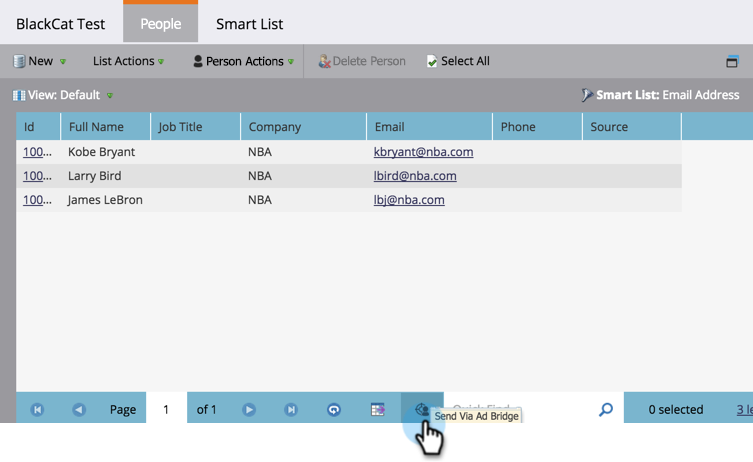

# Een Marketo-lijst of slimme lijst gebruiken als een LinkedIn Audience Segment {#use-a-marketo-list-or-smart-list-as-a-linkedin-audience-segment}

Integreer uw Marketo-mensen met uw LinkedIn-publiek.

>[!PREREQUISITES]
>
>[Aan LinkedIn aangepaste soorten publiek toevoegen als een opstartpuntservice](/help/marketo/product-docs/demand-generation/ad-network-integrations/add-linkedin-matched-audiences-as-a-launchpoint-service.md)

1. Ga naar de **Database**.

   

1. Selecteer een slimme lijst.

   

1. Klik op de knop **Mensen** tab.

   

1. Klik op de knop **Verzenden via Adobe Bridge** pictogram  onder aan de lijst.

   

   >[!NOTE]
   >
   >Als u via de integratie van het advertentienetwerk een publiek naar LinkedIn stuurt, stuurt Marketo alleen het e-mailadres over.

1. Selecteren **linkedIn** en klik op **Volgende**.

   

1. Selecteer een **linkedIn-publiek**.

   >[!NOTE]
   >
   >Klikken **+Nieuwe doelgroep** maakt een publiek in LinkedIn Campaign Manager.

   

   >[!NOTE]
   >
   >linkedIn heeft in maart 2018 de API&#39;s vervangen die worden gebruikt voor het pushtype &quot;Clear publiek and add lead&quot;. Deze optie is niet meer beschikbaar vanaf de Marketo-versie Q1 2018.

1. Selecteer een **Pushtype**. Klikken **Bijwerken**.

   

   >[!NOTE]
   >
   >De synchronisatie kan 15 minuten duren.

Hoogste vijf! Uw gegevens gaan nu samen met het publiek van LinkedIn. Ga voor informatie over het uploaden van lijsten naar LinkedIn voor account- en contactadres naar [linkedIn Marketing Solutions Help Center](https://www.linkedin.com/help/lms/answer/73938?query=ad%20segment).
