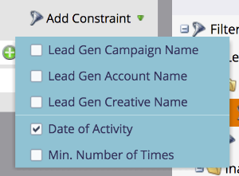

# LinkedIn Lead Gen Form Filters and Triggers gebruiken in een slimme campagne {#use-linkedin-lead-gen-form-filters-and-triggers-in-a-smart-campaign}

Wanneer u LinkedIn Lead Gen Forms hebt ingeschakeld, kunt u deze als filters en triggers gebruiken in uw slimme campagnes.

>[!NOTE]
>
>Wanneer mensen hun informatie verzenden in een LinkedIn Lead Gen Form, wordt deze informatie direct doorgestuurd naar Marketo, zodat het formulier beschikbaar is in de vervolgkeuzelijst Lead Gen Form Name. Formuliernamen zijn pas zichtbaar nadat ten minste één persoon het formulier heeft verzonden.

1. Gebruik de **Vult LinkedIn Lead Gen Form uit** onmiddellijk actie te ondernemen of **LinkedIn Lead Gen-formulier invullen** filter voor geplande batchcampagnes of standaard filter voor slimme lijsten.

   

1. Voeg beperkingen toe om uw resultaten verder te beperken.

   
