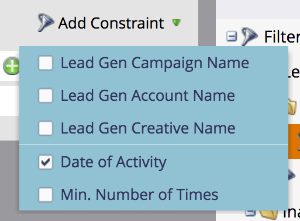

# LinkedIn Gen-formulierfilters en -triggers gebruiken in een slimme campagne {#use-linkedin-lead-gen-form-filters-and-triggers-in-a-smart-campaign}

Wanneer u LinkedIn Gen Forms hebt ingeschakeld, kunt u deze als filters en triggers gebruiken in uw slimme campagnes.

>[!NOTE]
>
>Wanneer mensen hun informatie verzenden in een LinkedIn Gen-formulier, wordt die informatie direct doorgestuurd naar Marketo, zodat het formulier beschikbaar is in de vervolgkeuzelijst Naam van lead-gen-formulier. Formuliernamen zijn pas zichtbaar nadat ten minste één persoon het formulier heeft verzonden.

1. Gebruik de trigger **[!UICONTROL Fills Out LinkedIn Lead Gen Form]** om onmiddellijk actie te ondernemen of het filter **[!UICONTROL Filled Out LinkedIn Lead Gen Form]** voor geplande batchcampagnes of het standaard filteren van slimme lijsten.

   

1. Voeg beperkingen toe om uw resultaten verder te beperken.

   
