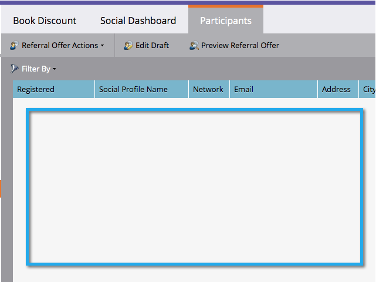

# Promo-codes gebruiken voor afhandeling van voorstellen {#use-promo-codes-for-offer-fulfillment}

Wanneer u een verwijzingsvoorstel of een zweepslag maakt, kunt u elke winnaar een promotiecode (coupon) sturen. Om hun beloning terug te betalen, gebruiken zij de code, bijvoorbeeld, op de checkout pagina van een aankoop op uw plaats.

>[!IMPORTANT]
>
>Op 31 juli 2024 begonnen we met het afschaffen van deze functie. Er kunnen geen nieuwe elementen meer worden gemaakt. Bestaande activa blijven werken tot 31 januari 2025. [ leer meer ](https://nation.marketo.com/t5/employee-blogs/marketo-engage-social-features-deprecation/ba-p/351977) {target="_blank"}

## Promo-codes uploaden {#upload-promo-codes}

1. Ga naar **de Marketing Activiteiten**.

   

1. Selecteer de verwijzingsaanbieding, en klik **uitgeven Ontwerp**.

   

1. In de verwijzingsaanbiedingsredacteur, ga naar **Montages van de Toepassing** en dan **Details van de Aanbieding**.

   

1. Onder E-mail, uitgezocht **Codes van de Aanbieding van het Gebruik**, en onder Upload Codes, doorbladert de klik **** om het dossier van de promotiecodes van uw systeem te selecteren.

   

1. Het bestand met promcodes moet een onbewerkte ASCII-tekstbestand zijn met één code per regel en de bestandsnaamextensie .txt. Bijvoorbeeld:

   

   >[!CAUTION]
   >
   >Elke witruimte in het bestand met promcodes wordt beschouwd als onderdeel van de code op die regel. Wees vooral voorzichtig en vermijd navolgende spaties aan het einde van elke regel.

1. Wanneer het uploaden is voltooid, wordt het totale aantal geüploade codes weergegeven.

   

## Door gebruiker verzonden aanbiedingscodes controleren {#review-sent-promo-codes}

Als deelnemers eenmaal beginnen met het verdienen van je aanbiedingsuitkering, kun je zien welke aanbiedingscodes naar wie en wanneer zijn verzonden.

>[!NOTE]
>
>Slechts hebben de gebruikers van Marketo met _toestemming van de Vergunning van de Toegang_ toegang tot deze informatie. Zie [ het Leiden Rollen van de Gebruiker en Toestemmingen ](/help/marketo/product-docs/administration/users-and-roles/managing-user-roles-and-permissions.md).

1. Ga naar **de Marketing Activiteiten**.

   

1. Selecteer uw verwijzingsaanbieding of transporten, en klik de **Deelnemers** tabel.

   

1. Hier ziet u wat items. Klik het aantal in de **kolom van de Codes van de Bevordering** om de bevorderingscodes te zien die werden verzonden naar die deelnemer, en wanneer.

   
