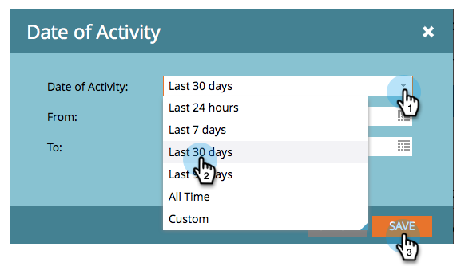

# Sociale prestaties weergeven {#view-social-performance}

Bekijk de sociale activiteiten die worden gegenereerd door uw sociale apps. Het sociale dashboard geeft u inzicht in de verschillende sociale interacties die worden gegenereerd door uw sociale apps, en stelt u in staat de prestaties van een sociale app te volgen.

>[!IMPORTANT]
>
>Op 31 juli 2024 begonnen we met het afschaffen van deze functie. Er kunnen geen nieuwe elementen meer worden gemaakt. Bestaande activa blijven werken tot 31 januari 2025. [ leer meer ](https://nation.marketo.com/t5/employee-blogs/marketo-engage-social-features-deprecation/ba-p/351977) {target="_blank"}

>[!AVAILABILITY]
>
>Niet alle gebruikers van het Marketo Engage hebben deze functionaliteit aangeschaft. Neem contact op met het accountteam van de Adobe (uw accountmanager) voor meer informatie.

1. Ga naar **de Marketing Activiteiten**.

   

1. Selecteer de sociale app.

   

1. Klik **Datum van Activiteit**.

   

1. Selecteer het tijdinterval.

   

   >[!NOTE]
   >
   >Als u **{24 uren** selecteert, worden de metriek berekend per uur, bij de bovenkant van het uur. Voor alle andere intervallen, worden de metriek in werking gesteld dagelijks, om middernacht van de vorige dag.

1. Gebruik het **Sociale Kanaal** om de sociale vooruitgang en de doeltreffendheid van uw bevordering te herzien.

   * **Bebezoeken van de Campagne**: Het aantal tijden dat de vooruitzichten een pagina laden die uw sociale app bevat.
   * **Interacties**: Het aantal tijden de vooruitzichten hebben met uw sociale app in wisselwerking gestaan, zoals het ondertekenen omhoog voor a [ verwijzingsaanbieding ](/help/marketo/product-docs/demand-generation/social/referral-offers/create-a-referral-offer.md), het stemmen in a [ opiniepeiling ](/help/marketo/product-docs/demand-generation/social/creating-a-poll/create-a-poll.md), [ het delen van een video ](/help/marketo/product-docs/demand-generation/landing-pages/free-form-landing-pages/add-a-video-to-a-free-form-landing-page.md), enz.
   * **Delen**: Het aantal tijden de vooruitzichten delen een bericht aan hun sociaal netwerk van uw sociale app.
   * **Resulterende Kliks**: Het aantal tijden klikte verbindingen in aandelen van uw sociale app.
   * **Registratie**: Het aantal vooruitzichten die zich voor uw bevordering na het volgen van een gedeelde verbinding terug naar uw app aanmelden.

   >[!NOTE]
   >
   >Bezoeken naar een pagina met meerdere sociale apps tellen als één bezoek aan elke pagina. Bebezoeken aan meerdere pagina&#39;s binnen dezelfde app tellen als één bezoek. Bezoekingen na meer dan 30 minuten of een herstart van de browser worden als nieuw beschouwd.

   

1. Gebruik het **paneel van het Publiek** om te herzien hoe uw vooruitzichten u helpen het woord uit krijgen.

   * **Totale Profielen**: Het totale aantal vooruitzichten die binnen aan sociale netwerken van uw sociale app hebben ondertekend.
   * **Influencers**: Het aantal vooruitzichten die minstens één resulterend klik van een app aandeel hebben geproduceerd.
   * **Sociale Bereik**: De som van alle vooruitzichten&#39; verbindingen. Voor vooruitzichten die aan sociale netwerken delen, is dit het aantal vrienden die zij op het tijdstip hebben gehad zij van uw sociale app deelden. Voor het delen van e-mail is dit het aantal ontvangers van de e-mail die zij genereren via uw app.
   * **Sociale Impressies**: Het totale aantal tijden dat uw sociale app in het voer van vooruitzichten&#39; verbindingen verscheen.

   

1. Gebruik het **paneel van Metriek van het Aandeel** om de bijeengevoegde sociale activiteit te herzien die door uw sociale app wordt geproduceerd.

   * **Tarief van het Aandeel**: Het percentage bezoeken aan uw app die een aandeel produceren.
   * **Clickback Tarief**: Het aantal resulterende kliks per aandeel.
   * **Sociale Lift**: De verhouding van bezoeken aan uw app (die uit de verbinding in aandelen komen) aan het aantal niet-sociale bezoeken (uit bronnen buiten uw sociale app).

   

>[!MORELIKETHIS]
>
>U kunt ook triggers en filters gebruiken om te zien wie uw inhoud deelt en met uw sociale apps werkt, zodat u op die interacties kunt reageren. Zie [ Trekkers en Filters van het Gebruik voor Sociale Activiteiten ](/help/marketo/product-docs/demand-generation/social/social-functions/triggers-and-filters-for-social-activities.md).
