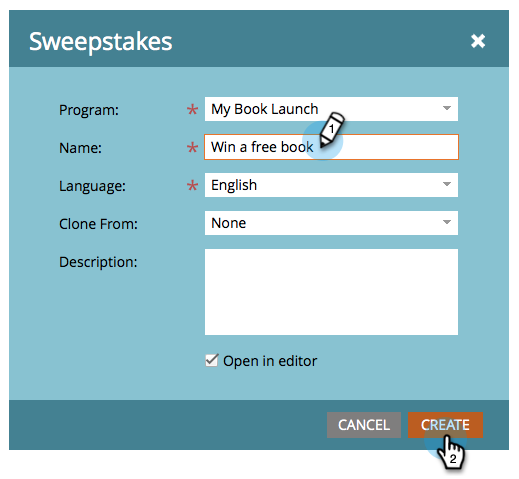

# Overtreklijnen maken {#create-sweepstakes}

Een zweten geeft mensen de kans om een prijs te winnen in ruil voor het vertellen van hun vrienden over je. U kunt het op bestemmingspagina&#39;s, uw website, en zelfs Facebook laten vallen.

>[!IMPORTANT]
>
>Op 31 juli 2024 begonnen we met het afschaffen van deze functie. Er kunnen geen nieuwe elementen meer worden gemaakt. Bestaande activa blijven werken tot 31 januari 2025. [ leer meer ](https://nation.marketo.com/t5/employee-blogs/marketo-engage-social-features-deprecation/ba-p/351977) {target="_blank"}

>[!AVAILABILITY]
>
>Niet alle gebruikers van het Marketo Engage hebben deze functionaliteit aangeschaft. Neem contact op met het accountteam van de Adobe (uw accountmanager) voor meer informatie.

1. Binnen uw programma, uitgezochte **Nieuw** > **Nieuwe Lokale Activa**.

   

1. In de Lokale Galerij van Activa, klik **Overbodig**.

   

1. Geef uw transporten een naam.

   

   >[!TIP]
   >
   >Om tijd te besparen, kunt u de **Kloon van** optie gebruiken om alle montages van een bestaande transporten te kopiëren.

   De sweepstakes-editor wordt in een nieuw venster geopend. De standaardmontages zijn allen goed, maar u moet nog een paar details vormen. In de volgende stappen laten we u zien hoe u dat doet.

1. Klik **Details van de Zeggen**.

   

1. Selecteer de frequentie, de begin- en einddatum en uw tijdzone.

   

   >[!NOTE]
   >
   >Voor dagelijkse en wekelijkse tekeningen worden de begin- en eindtijd vastgesteld op respectievelijk 12.00 uur en 11.59 uur. Voor een eenmalige tekening kunt u uw eigen begin- en eindtijd kiezen.

1. Klik **Geavanceerde Opties**.

   

1. Voeg een koppeling toe aan de regels van uw transporten. Voer de URL in. Deze koppeling is vereist.

   

   De koppeling wordt onder in de berichtvensters voor delen weergegeven.

   >[!NOTE]
   >
   >Op dit scherm kunt u ook een koppeling naar het privacybeleid toevoegen. Zie [ Uw Beleid van de Privacy aan een Sociale app ](/help/marketo/product-docs/demand-generation/social/social-functions/add-your-privacy-policy-to-a-social-app.md) toevoegen.

1. Klik **Afwerking**.

   

1. Klik **goedkeuren en sluiten**.

   

   >[!TIP]
   >
   >Om om het even welke gebreken in uw transporten te veranderen, klik **terug**. Om uw werk voor later te bewaren zonder goed te keuren, klik **dicht**.

Als er problemen zijn in de transporten, wordt u gevraagd deze te verhelpen voordat de transpiratieaanvallen zijn goedgekeurd.

Gefeliciteerd! U hebt een truc gemaakt.

>[!MORELIKETHIS]
>
>De volgende stap moet [ uw transporten ](/help/marketo/product-docs/demand-generation/social/sweepstakes/publish-a-sweepstakes.md) publiceren, maar u kunt de verschijning en de montages van uw transporten veranderen. Begin met [ het aanpassen van uw transporten stijlen ](/help/marketo/product-docs/demand-generation/social/sweepstakes/customize-sweepstakes-styles.md).
