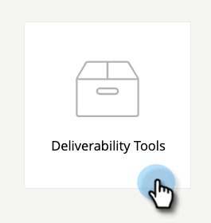

# E-maillevering Power Pack: Een zaadlijst importeren {#email-deliverability-power-pack-how-to-import-a-seed-list}

Een zaadlijst is een lijst van e-mailrekeningen bij veelvoudige brievenbusleveranciers, met inbegrip van de Apps van Google, Hotmail, Yahoo!, enz., die worden gebruikt om het tarief van inbox tegenover spamomslaglevering te benaderen. Hieronder vindt u de stappen waarmee u die lijst in uw Marketo Engage-exemplaar ophaalt.

>[!IMPORTANT]
>
>Dit artikel is bedoeld voor diegenen die momenteel een actieve Everest-abonnement hebben. Als u de Traceur van Inbox door Vogel (vroeger MessageBird) gebruikt, kunnen uw leerprogramma&#39;s [ hier ](/help/marketo/product-docs/email-marketing/deliverability/inbox-tracker/inbox-tracker-tutorials.md){target="_blank"} worden gevonden.

## Een zaadlijst importeren {#import-a-seed-list}

1. Selecteer **[!UICONTROL Deliverability Tools]** in Mijn Marketo.

   

1. De [!DNL Everest] -toepassing wordt geopend. Klik in de linkernav op **[!UICONTROL In-Flight]** en selecteer **[!UICONTROL Inbox Placement]** .

   

1. Klik op de tab **[!UICONTROL Manage Seed List]** .

   

1. Klik op de vervolgkeuzelijst **[!UICONTROL Actions]** en selecteer **[!UICONTROL Download: One Per Line]** .

   

   >[!NOTE]
   >
   >Gebruik de functie Zaadlijst optimaliseren (boven aan de pagina) als u wilt dat [!DNL Everest] de lijst voor u optimaliseert.

1. Na het exporteren wordt de lijst weergegeven als een TXT-bestand in de downloadmap van uw browser. Haal het terug, en [ voer ](/help/marketo/getting-started/quick-wins/import-a-list-of-people.md) het in uw instantie van Marketo als statische lijst in.

   

   >[!TIP]
   >
   >Geef de lijst een naam, zodat je deze gemakkelijk kunt vinden.

   >[!CAUTION]
   >
   >U krijgt een beperkte hoeveelheid van deze campagnes van de Plaatsing Inbox per maand. Als u wilt zien hoeveel er worden, raadpleegt u de sectie [!UICONTROL Subscription] onder [!UICONTROL Account Settings] > [!UICONTROL Subscription] in [!DNL Everest] . Neem contact op met je Marketo-verkoper voor meer informatie.

## Nieuwe zaadlijsten ophalen {#acquiring-new-seedlists}

Uw zaadlijst kan zo vaak veranderen zoals elke maand. Het is belangrijk om u regelmatig aan te melden bij het Power Pack voor e-maillevering en de status van uw zaadlijst te controleren. Wanneer nieuwe adressen worden toegevoegd of een update op uw eind wordt vereist, zult u via het Pictogram van het Bericht op de lagere linkerkant van de toepassing worden gealarmeerd.

Nadat u de statische lijst in Marketo hebt gemaakt, kunt u beginnen met het verzenden naar deze lijst om de plaatsing van uw e-mailpostvak te testen.
