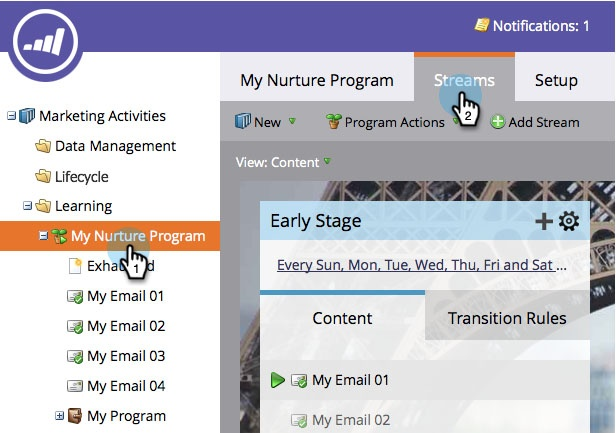

# Een stream toevoegen {#add-a-stream}

Betrokkenheidsprogramma&#39;s kunnen meerdere streams bevatten. Hieronder wordt beschreven hoe u een nieuwe toevoegt.

1. Ga naar **[!UICONTROL Marketing Activities]** .

   

1. Selecteer uw betrokkenheidsprogramma en klik op de tab **[!UICONTROL Streams]** .

   

1. Klik op **[!UICONTROL Add Stream]**.

   

   >[!NOTE]
   >
   >U kunt maximaal 25 streams per betrokkenheidsprogramma toevoegen.

   En... klaar!

   
