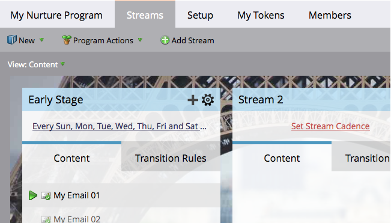

# Een stream toevoegen {#add-a-stream}

Betrokkenheidsprogramma&#39;s kunnen meerdere streams bevatten. Hieronder wordt beschreven hoe u een nieuwe toevoegt.

1. Ga naar **Marketingactiviteiten**.

   

1. Selecteer uw serviceprogramma en klik op de knop **Streams** tab.

   

1. Klikken **Stream toevoegen**.

   

   >[!NOTE]
   >
   >U kunt maximaal 25 streams per betrokkenheidsprogramma toevoegen.

   En... klaar!

   
