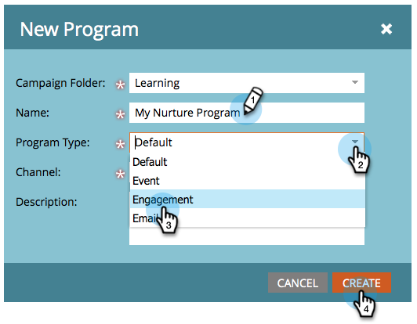
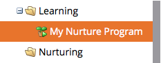

# Een betrokkenheidsprogramma maken {#create-an-engagement-program}

Met betrokkenheidsprogramma&#39;s in Marketo kunt u eenvoudig zorgen voor e-mail.

1. Ga naar **Marketingactiviteiten**.

   

1. Selecteer de map waarin u het betrokkenheidsprogramma wilt maken en klik vervolgens op **Nieuw** en **Nieuw programma**.

   

1. Voer een **Naam**, selecteert u **Betrokkenheid** for **Type programma** en klik op **Maken**.

   

1. Nu je een betrokkenheidsprogramma hebt, gaan we verder en gaan we het omhoog.

   

   >[!MORELIKETHIS]
   >
   >* [Inhoud toevoegen aan een stream](/help/marketo/product-docs/email-marketing/drip-nurturing/creating-an-engagement-program/add-content-to-a-stream.md)
   >* [Stroomversnelling instellen](/help/marketo/product-docs/email-marketing/drip-nurturing/engagement-program-streams/set-stream-cadence.md)
