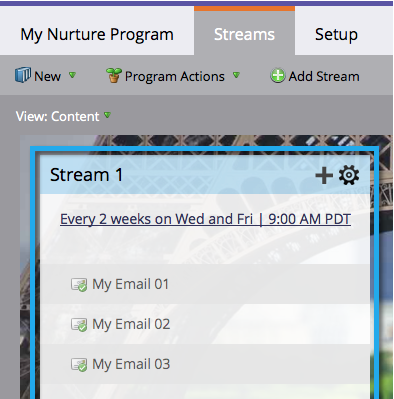

# Betrokkenheidsprogramma&#39;s {#understanding-engagement-programs}

Betrokkenheidsprogramma&#39;s zijn bedoeld om nieuwe mensen op de markt te brengen door ze systematisch inhoud voor te leggen.

>[!NOTE]
>
>Er is een grens van 100 **actieve** betrokkenheidsprogramma&#39;s per abonnement.

## Programma voor betrokkenheid {#engagement-program}

Een **betrokkenheidsprogramma** is een type van programma dat complexe verpleegkundigen met gemak kan verwezenlijken.

>[!MORELIKETHIS]
>
>[ creeer een Programma van de Betrokkenheid ](/help/marketo/product-docs/email-marketing/drip-nurturing/creating-an-engagement-program/create-an-engagement-program.md)

## Streamen {#stream}

A **stroom** is een pool van prioritaire inhoud die het betrokkenheidsprogramma zal gebruiken om mensen te voeden.

>[!MORELIKETHIS]
>
>* [ voeg een Stroom ](/help/marketo/product-docs/email-marketing/drip-nurturing/creating-an-engagement-program/add-a-stream.md) toe
>* [ Kloon een Stroom ](/help/marketo/product-docs/email-marketing/drip-nurturing/engagement-program-streams/clone-a-stream.md)

## Inhoud {#content}

Er zijn twee soorten **inhoud** u aan de stromen-e-mail en programma&#39;s van het betrokkenheidsprogramma kunt toevoegen. E-mails worden op het moment van de cast naar mensen verzonden.

>[!MORELIKETHIS]
>
>* [ voeg Inhoud aan een Stroom ](/help/marketo/product-docs/email-marketing/drip-nurturing/creating-an-engagement-program/add-content-to-a-stream.md) toe
>* [ Prioritize de Inhoud van de Stroom ](/help/marketo/product-docs/email-marketing/drip-nurturing/using-stream-content/prioritize-stream-content.md)
>* [ geeft Beschikbaarheid van de Inhoud van de Stroom uit ](/help/marketo/product-docs/email-marketing/drip-nurturing/using-stream-content/edit-availability-of-stream-content.md)
>* [ verwijder de Inhoud van de Stroom ](/help/marketo/product-docs/email-marketing/drip-nurturing/using-stream-content/remove-stream-content.md)
>* [ Inhoud van de Stroom van het Archief en Unarchive ](/help/marketo/product-docs/email-marketing/drip-nurturing/using-stream-content/archive-and-unarchive-stream-content.md)

## Gegoten {#cast}

A **gegoten** is de gebeurtenis om e-mails van een Programma van de Betrokkenheid te verzenden.

>[!NOTE]
>
>Betrokkenheidsprogramma&#39;s zijn niet ontworpen voor gebruik met operationele e-mails.

## Stream Cadence {#stream-cadence}

U besluit wanneer een gietvorm door vestiging **stroomkadentie** gebeurt. Zo plant u inhoud om met regelmatige intervallen uit te gaan.

>[!MORELIKETHIS]
>
>[ plaats de Koorden van de Stroom ](/help/marketo/product-docs/email-marketing/drip-nurturing/engagement-program-streams/set-stream-cadence.md)

## Persoon Cadence {#person-cadence}

A **persoonkadentie** is een status die zijn capaciteit bepaalt om inhoud van een betrokkenheidsprogramma te ontvangen. U kunt de stap **[!UICONTROL Change Engagement Program Cadence]** flow gebruiken om deze in [!UICONTROL Paused] of [!UICONTROL Normal] te wijzigen.

## Geëxhausd {#exhausted}

Zodra een persoon elk stuk van inhoud in een stroom heeft ontvangen, roepen wij de persoon **Uitgedreven**.

>[!MORELIKETHIS]
>
>[ Mensen die inhoud ](/help/marketo/product-docs/email-marketing/drip-nurturing/using-engagement-programs/people-who-have-exhausted-content.md) hebben uitgeput

## Niveau van betrokkenheid bij inhoud {#content-engagement-level}

Het niveau van de betrokkenheid bij inhoud is een score van 0 tot 100 punten die Marketo aan uw inhoud zal geven. Dit aantal wordt bepaald door een verfijnde formule gebruikend opent, klikt, unsubscribes, programmasucces, en andere factoren.

>[!MORELIKETHIS]
>
>[ Begrijpend de Score van de Betrokkenheid ](/help/marketo/product-docs/email-marketing/drip-nurturing/reports-and-notifications/understanding-the-engagement-score.md)
