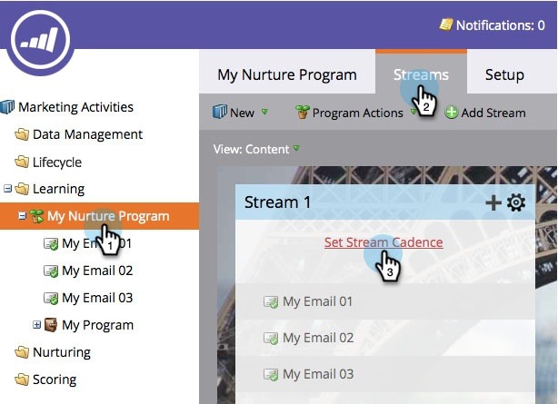

# Stroomversnelling instellen {#set-stream-cadence}

U kunt betrokkenheidsinhoud verzenden met elk gewenst interval. Bijvoorbeeld: eenmaal per week, of elke derde dinsdag van de maand.

## Cadence instellen {#set-cadence}

1. Ga naar **[!UICONTROL Marketing Activities]** .

   

1. Zoek en selecteer uw betrokkenheidsprogramma, klik op de tab **[!UICONTROL Streams]** en klik vervolgens op **[!UICONTROL Set Stream Cadence]** .

   

1. Selecteer hoe vaak u de cadence wilt herhalen. U kunt **[!UICONTROL Weekly]** of **[!UICONTROL Monthly]** kiezen.

## Wekelijks {#weekly}

1. Selecteer **[!UICONTROL Weekly]**.

   

   >[!NOTE]
   >
   >Als u **[!UICONTROL None]** selecteert, wordt de stream afgesloten.

1. Kies de datum van de eerste gietvorm.

   

1. Kies nu of u wilt dat de stilte elke week of meer op afstand plaatsvindt. Laten we elke 2 weken kiezen.

   

1. Bepaal welke dagen van de week. Laten we in dit geval dinsdag, woensdag en donderdag doen.

   

   >[!TIP]
   >
   >U kunt instellen dat de frequentie elke dag wordt uitgevoerd door **[!UICONTROL Repeats]:[!UICONTROL Weekly]** / **[!UICONTROL Every]: 1[!UICONTROL Week]** / **[!UICONTROL On]** : alle dagen te kiezen.

   Kies nu de tijd. Controleer de doos als u [ Ontvankelijke Streek van de Tijd ](/help/marketo/product-docs/email-marketing/drip-nurturing/engagement-program-streams/set-stream-cadence/schedule-engagement-programs-with-recipient-time-zone.md) (d.w.z., levert volgens lokale tijdstreken) wilt gebruiken, dan klik **[!UICONTROL Save]**.

   

   >[!CAUTION]
   >
   >De inhoud zal uit gaan op de datum u voor de eerste gietvorm selecteert, zodat het samenvalt met de dag van de week u kiest; anders zal het tweemaal in de eerste week gaan.

1. Houd de kop boven de cadence. U zult zien welke dagen toekomstige casts zullen gaan.

   

   >[!NOTE]
   >
   >In dit voorbeeld gaat een e-mail naar donderdag. We slaan vervolgens een week over en sturen deze opnieuw op dinsdag, woensdag en donderdag van de volgende week. En dan herhalen we ons opnieuw.

Dat is het! Blijf lezen als u een maandelijks stilletje wilt instellen.

## Maandelijks {#monthly}

1. Selecteer **[!UICONTROL Monthly]** voor hoe vaak het herhaalt.

   

1. Kies de datum van de eerste gietvorm.

   

1. Selecteer deze optie als u deze elke maand of meer uit elkaar wilt houden... Laten we elke vierde maand kiezen.

   

1. Kies de dag van de maand die u hebt opgegeven, in dit geval de tweeëntwintigste van elke vierde maand.

   

   >[!TIP]
   >
   >U kunt ook de dag van de week kiezen.

1. Kies een **[!UICONTROL Time]** en klik op **[!UICONTROL Save]** .

   

1. Houd de kop boven de cadence. U zult zien welke dagen toekomstige casts zullen gaan.

   

   >[!CAUTION]
   >
   >Als u besluit om uw contractstroomingang later te wijzigen, zorg ervoor de eerste gietvorm aan een toekomstige datum wordt geplaatst.

Nu weet u hoe u een streamkadentie kunt instellen!

>[!MORELIKETHIS]
>
>* [ Begrijpend Ontvankelijke Tijdzone van de Tijd ](/help/marketo/product-docs/email-marketing/email-programs/email-program-actions/scheduling-with-recipient-time-zone/understanding-recipient-time-zone.md)
>* [ Programma&#39;s van de Betrokkenheid van het Programma met de Ontvankelijke Streek van de Tijd ](/help/marketo/product-docs/email-marketing/drip-nurturing/engagement-program-streams/set-stream-cadence/schedule-engagement-programs-with-recipient-time-zone.md)
