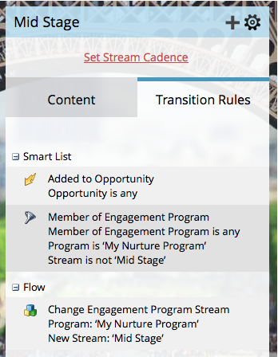

# Overgang mensen tussen betrokkenheidsstromen {#transition-people-between-engagement-streams}

Betrokkenheidsprogramma&#39;s kunnen meerdere streams hebben. Als u [ een stroom ](/help/marketo/product-docs/email-marketing/drip-nurturing/creating-an-engagement-program/add-a-stream.md) toevoegt, zult u een manier voor mensen willen bepalen om zich van één stroom aan een andere te bewegen. Deze worden genoemd **overgangsregels.**

1. Ga naar **[!UICONTROL Marketing Activities]** .

   

1. Selecteer uw serviceprogramma voor meerdere stromen en ga naar **[!UICONTROL Streams]** .

   

1. Klik op **[!UICONTROL Transition Rules]** voor de stream waarin u andere streams wilt plaatsen en klik vervolgens op **[!UICONTROL Edit Transition Rules]** .

   

   >[!NOTE]
   >
   >De overgangsregels trekken in een stroom terug; bepalen altijd de regels op de stroom die u wilt trekken.

   Wanneer het venster met de overgangsregel wordt geopend, zoekt en sleept u in de gewenste trigger. In dit geval willen we mensen naar [!UICONTROL Mid Stage] verplaatsen wanneer deze aan een kans wordt toegevoegd.

   

1. Stel de operator in op **[!UICONTROL is any]** , zodat de personen naar de andere operator gaan voor extra mogelijkheden.

   

   >[!TIP]
   >
   >U kunt meerdere triggers en filters toevoegen aan een overgangsregel, maar de overgangsregel gebruikt alle filters (ALLE filters zijn de enige optie). Als u OF in een overgangsregel moet gebruiken, adviseren wij dat u opstelling een buitenslimme campagne in plaats daarvan.

1. Klik op **[!UICONTROL Close]**.

   

   Geweldig! Iedereen in uw betrokkenheidsprogramma die aan een opportuniteit is toegevoegd, wordt nu naar de [!UICONTROL Mid Stage] -stream verplaatst.

   

   >[!NOTE]
   >
   >De stappen hierboven geschetst *zijn* van toepassing op mensen die [ op pauze ](/help/marketo/product-docs/email-marketing/drip-nurturing/using-engagement-programs/pause-people-in-an-engagement-program.md) eveneens zijn.
