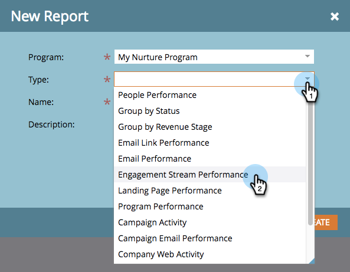

# Prestatierapport voor betrokkenheidsstream {#engagement-stream-performance-report}

Wilt u weten hoe de inhoud van uw service presteert? Probeer het prestatierapport voor de betrokkenheidsstream.

## Het rapport maken {#create-the-report}

1. Zoek en selecteer uw betrokkenheidsprogramma en klik vervolgens onder **[!UICONTROL New]** **[!UICONTROL New Local Asset]** .

   

1. Selecteer **[!UICONTROL Report]** .

   

   >[!TIP]
   >
   >Het opstellen van het verslag in het kader van het programma beperkt het automatisch tot de inhoud van het programma.

   Selecteer **[!UICONTROL Engagement Stream Performance]** als het rapport **[!UICONTROL Type]** .
   

1. Geef een naam op voor uw rapport en klik op **[!UICONTROL Create]** .

   

   Goed! Laten we nu de instellingen uitchecken.

## Instellingen bewerken {#edit-settings}

1. Zoek en selecteer uw rapport.

   

1. Dubbelklik op het filter **[!UICONTROL Setup]** onder het tabblad **[!UICONTROL Engagement Program Emails]** .

   

1. Selecteer de e-mail(s) die u wilt melden en klik op **[!UICONTROL Apply]** .

   

## Rapport uitvoeren {#run-report}

1. Als u het rapport wilt uitvoeren, klikt u gewoon op de tab **[!UICONTROL Report]** .

   

   >[!TIP]
   >
   >Hoewel niet geïllustreerd, is de Score van de Betrokkenheid een kolom in dit rapport. Zie [ Begrijpend de Score van de Betrokkenheid ](/help/marketo/product-docs/email-marketing/drip-nurturing/reports-and-notifications/understanding-the-engagement-score.md) voor details over wat het is.

   Geweldig werk! Het rapport is gegroepeerd op betrokkenheidsprogramma.
