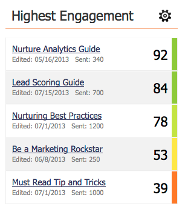

# Het betrokkenheidsdashboard {#the-engagement-dashboard}

Het betrokkenheidsdashboard is de eenvoudigste manier om te zien hoe de inhoud in uw betrokkenheidsprogramma wordt uitgevoerd.

>[!NOTE]
>
>De betrokkenheidsscore bevat gegevens uit de laatste drie casts. Een nieuwe wordt berekend 72 uur na elke gietvorm. Meer informatie over de [betrokkenheidsscore](/help/marketo/product-docs/email-marketing/drip-nurturing/reports-and-notifications/understanding-the-engagement-score.md).

## Het dashboard Betrokkenheid weergeven {#view-the-engagement-dashboard}

Selecteer uw serviceprogramma en klik op **Weergave** > **Dashboard**.

>[!TIP]
>
>Kijk uit de [betrokkenheidsstreamprestatierapport](/help/marketo/product-docs/email-marketing/drip-nurturing/reports-and-notifications/engagement-stream-performance-report.md) voor meer gedetailleerde statistieken.

## De extrusiewidget begrijpen {#understand-the-exhaustion-widget}

Met deze widget kunt u anticiperen wanneer leads alle inhoud bevatten. De uitputtingsscore wordt onmiddellijk na elke gietvorm berekend. In het onderstaande voorbeeld ziet u dat bij 1 cast 195 leads alle inhoud zullen hebben uitgeput.

>[!NOTE]
>
>U moet in het lusje van de Opstelling gaan en ervoor zorgen de Uitgebreide Inhoudsberichten zijn **Aan** om de bovenstaande grafiek te zien. Als ze uit zijn, ziet de grafiek er anders uit.

>[!CAUTION]
>
>De mensen die &quot;uitgeput&quot;zijn zullen geen mededeling in de volgende gietvorm ontvangen.

## Begrijp de Betrokkenheid over tijd widget {#understand-the-engagement-over-time-widget}

Geeft de gemiddelde betrokkenheidsscore over een bepaalde periode weer en de impact van inhoudsbewerkingen.

>[!AVAILABILITY]
>
>Deze functie is beschikbaar als een invoegtoepassing voor klanten die gebruikmaken van de Internet Explorer van Marketo. Neem contact op met het Adobe-accountteam (uw accountmanager) voor meer informatie.

Als u één stuk inhoud in plaats van een gemiddelde wilt weergeven, klikt u op het tandwielpictogram en selecteert u het stuk inhoud.

## De hoogste widget voor betrokkenheid begrijpen {#understand-the-highest-engagement-widget}

Een lijst van alle inhoud, die door de hoogste betrokkenheidsscore wordt bevolen.

Als u het sorteren wilt wijzigen, klikt u op het tandwielpictogram en selecteert u de sorteervolgorde.

_Nieuwst_ en _Oudst_ zijn gebaseerd op het tijdstip van de laatste goedkeuring.

>[!NOTE]
>
>Meer informatie in het dialoogvenster [Een betrokkenheidsprogramma maken](/help/marketo/product-docs/email-marketing/drip-nurturing/creating-an-engagement-program/create-an-engagement-program.md) diep duiken.
