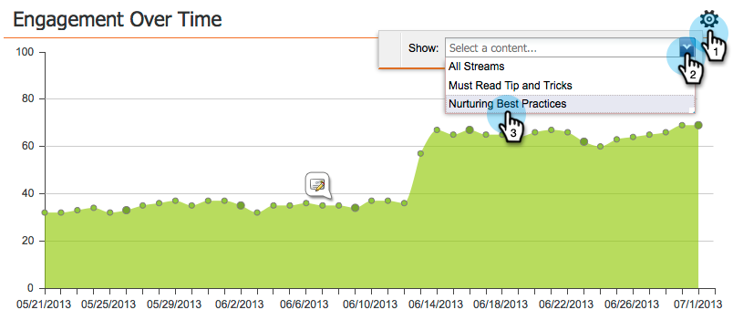

# Het betrokkenheidsdashboard {#the-engagement-dashboard}

Het betrokkenheidsdashboard is de eenvoudigste manier om te zien hoe de inhoud in uw [betrokkenheidsprogramma](http://docs.marketo.com/display/docs/drip+nurturing) &#39;s presteert.

>[!NOTE]
>
>De betrokkenheidsscore wordt 72 uur na elke cast berekend. Meer informatie over de [betrokkenheidsscore](understanding-the-engagement-score.md).

## Het dashboard Betrokkenheid weergeven {#view-the-engagement-dashboard}

Selecteer uw betrokkenheidsprogramma en klik op **Weergave > Dashboard**.

>[!TIP]
>
>Bekijk het prestatierapport [van de](engagement-stream-performance-report.md) betrokkenheidsstream voor gedetailleerdere statistieken.

## De extrusiewidget begrijpen {#understand-the-exhaustion-widget}

Met deze widget kunt u anticiperen wanneer leads alle inhoud bevatten. De uitputtingsscore wordt onmiddellijk na elke gietvorm berekend. In het onderstaande voorbeeld ziet u dat bij 1 cast 195 leads alle inhoud zullen hebben uitgeput.

>[!NOTE]
>
>U moet naar het tabblad Setup gaan en ervoor zorgen dat Uitgebreide meldingen over inhoud zijn **ingeschakeld** om de bovenstaande grafiek te kunnen zien. Als ze uit zijn, ziet de grafiek er anders uit.

>[!CAUTION]
>
>De mensen die &quot;uitgeput&quot;zijn zullen geen mededeling in de volgende gietvorm ontvangen.

## Begrijp de Betrokkenheid over tijd widget {#understand-the-engagement-over-time-widget}

Geeft de gemiddelde betrokkenheidsscore over een bepaalde periode weer en de impact van inhoudsbewerkingen.

>[!NOTE]
>
>**Beschikbaarheid**
>
>Deze eigenschap is beschikbaar als toe:voegen-op voor klanten die de Ontdekkingsreiziger van de Cyclus van de Opbrengst van Marketo gebruiken. Neem contact op met de succesmanager van de klant voor meer informatie.

Als u één stuk inhoud in plaats van een gemiddelde wilt weergeven, klikt u op het tandwielpictogram en selecteert u het stuk inhoud.

## De hoogste widget voor betrokkenheid begrijpen {#understand-the-highest-engagement-widget}

Een lijst van alle inhoud, die door de hoogste betrokkenheidsscore wordt bevolen.

Als u het sorteren wilt wijzigen, klikt u op het tandwielpictogram en selecteert u de sorteervolgorde.

*Nieuwste* en *Oudste* zijn gebaseerd op het tijdstip van de laatste goedkeuring.

>[!NOTE]
>
>**Diep duiken**
>
>Meer informatie vindt u in de diepe duik van het programma  Betrokkenheid maken.

