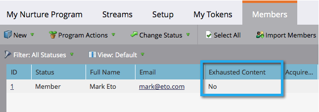

# Personen die inhoud hebben geëxporteerd {#people-who-have-exhausted-content}

Wanneer een persoon alle inhoud in een stream heeft ontvangen, heeft deze alle mogelijkheden uitgeput en wacht deze tot er meer inhoud is toegevoegd. Je kunt mensen vinden die op verschillende manieren &#39;uitgeput&#39; zijn.

## Lid van het filter Betrokkenheidsprogramma {#member-of-engagement-program-filter}

1. Maak een nieuwe slimme lijst en zoek en sleep in het filter **[!UICONTROL Member of Engagement Program]** .

   

1. Zoek en selecteer het betrokkenheidsprogramma waarin u uitgeputte mensen kunt vinden.

   

1. Selecteer onder **[!UICONTROL Add Constraint]** de optie **[!UICONTROL Exhausted Content]** .

   

1. Stel **[!UICONTROL Exhausted Content]** in op **[!UICONTROL true]** .

   

   Voer deze slimme lijst gewoon uit om de lijst weer te geven met mensen die alle inhoud in de stream waarin ze zich bevinden, hebben uitgeput.

## Tabblad Leden {#members-tab}

1. Ga naar **[!UICONTROL Marketing Activities]** .

   

1. Selecteer uw betrokkenheidsprogramma en ga naar de tab **[!UICONTROL Members]** .

   

1. Let op de kolom met de naam **[!UICONTROL Exhausted Content]** .

   

   Dit toont u mensen die alle inhoud hebben uitgeput en zij die niet hebben.

## Streamen {#stream}

1. U kunt ook het totaal aantal personen zien die uitgeputte inhoud hebben onder het tabblad [!UICONTROL Streams] op de stream zelf.

   

   >[!NOTE]
   >
   >Dit aantal zal onmiddellijk na elke gietvorm bijwerken.
