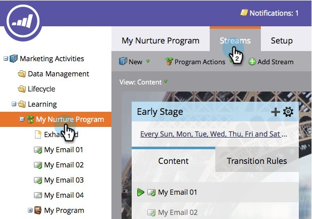

# Stroominhoud archiveren en archiveren {#archive-and-unarchive-stream-content}

Als u een stuk inhoud in een stroom niet meer wilt gebruiken, kunt u of [remove](/help/marketo/product-docs/email-marketing/drip-nurturing/using-stream-content/remove-stream-content.md) of archiveer het. Hieronder wordt beschreven hoe u inhoud kunt archiveren.

>[!TIP]
>
>Als u deze optie verwijdert, wordt alle bijbehorende geschiedenis vernietigd. archiveren behoudt het.

## Stream-inhoud archiveren {#archive-stream-content}

1. Selecteer uw serviceprogramma en ga naar de **Streams** tab.

   

1. Houd de muis boven de e-mail die u wilt archiveren en klik vervolgens onder het tandwielpictogram op **Archief**.

   

   Dat is het! Herinner me, archiveer als u geschiedenis wilt bewaren.

## Stream-inhoud verwijderen {#unarchive-stream-content}

1. Selecteer uw serviceprogramma en ga naar de **Streams** tab.

   

1. Klik op het tandwielpictogram voor uw stream en klik vervolgens op **Gearchiveerde inhoud tonen**.

   

1. Nu u de gearchiveerde inhoud kunt zien, klikt u op het tandwielpictogram voor de inhoud die u wilt verwijderen en klikt u vervolgens op **Unarchive**.

   

   Perfect! Deze inhoud kan nu worden geprioriteerd en geactiveerd.
