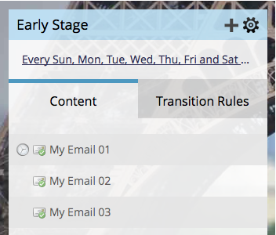

# Beschikbaarheid van stroominhoud bewerken {#edit-availability-of-stream-content}

U kunt een tijdframe instellen waarin de inhoud actief wordt in uw stream. Zo gaat het.

1. Selecteer uw betrokkenheidsprogramma en ga naar de tab **[!UICONTROL Streams]** .

   

1. Klik op het tandwielpictogram voor de inhoud die u wilt plannen en selecteer vervolgens **[!UICONTROL Edit Availability]** .

   

1. Selecteer de **[!UICONTROL Active From]** -datum, kies de **[!UICONTROL Active Through]** -datum en klik op **[!UICONTROL Save]** .

   

   >[!TIP]
   >
   >U kunt **[!UICONTROL Active Through]** leeg laten om inhoud voor altijd beschikbaar te maken.

   Perfect! Het klokpictogram wordt weergegeven naast de geplande inhoud. Het wordt actief en inactief volgens het schema dat u instelt.

   
