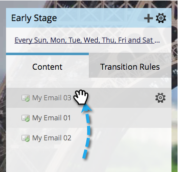

# Stroominhoud prioriteren {#prioritize-stream-content}

Nadat u inhoud aan uw stroom hebt toegevoegd, kunt u de prioriteit willen veranderen. De inhoud wordt altijd geleverd van de bovenkant neer in elke gietvorm, en geen inhoud wordt verzonden naar de zelfde persoon tweemaal.

1. Ga naar **[!UICONTROL Marketing Activities]** .

   

1. Selecteer uw betrokkenheidsprogramma en klik op de tab **[!UICONTROL Streams]** .

   

1. Sleep de inhoud nu gewoon naar de gewenste volgorde.

   

   >[!NOTE]
   >
   >De prioriteit zal altijd van boven tot onder in tijd van gietvorm worden gelezen.

   Zo eenvoudig is het! Nu weet u hoe u prioriteit kunt geven aan uw streaminhoud.
